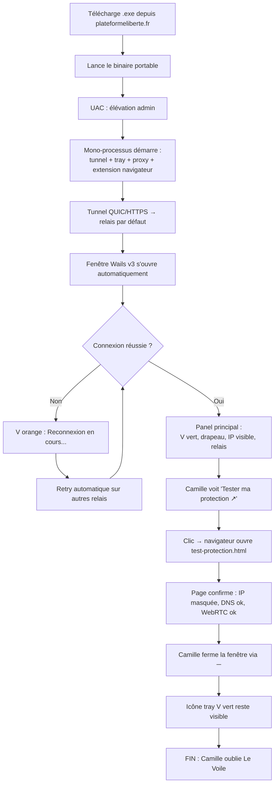
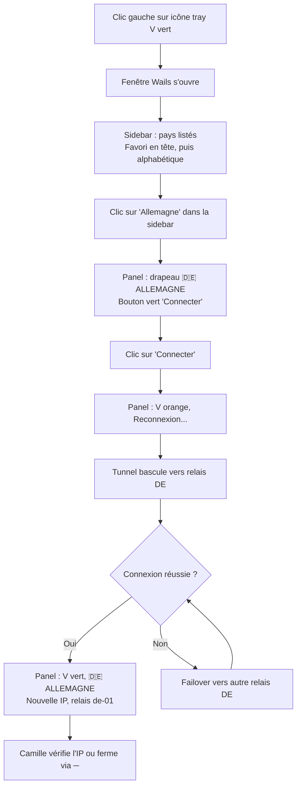
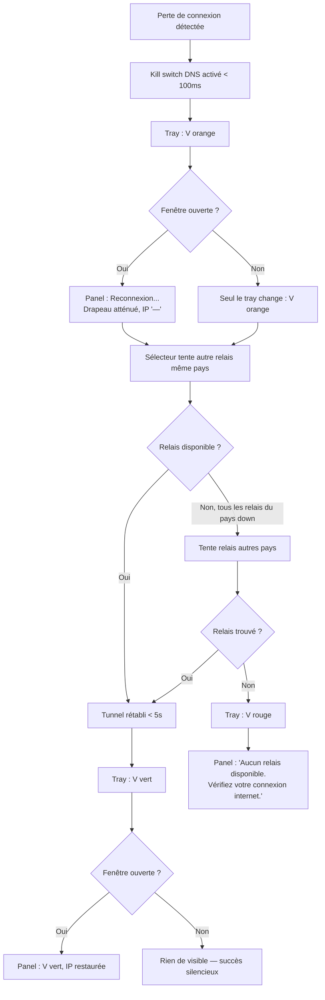
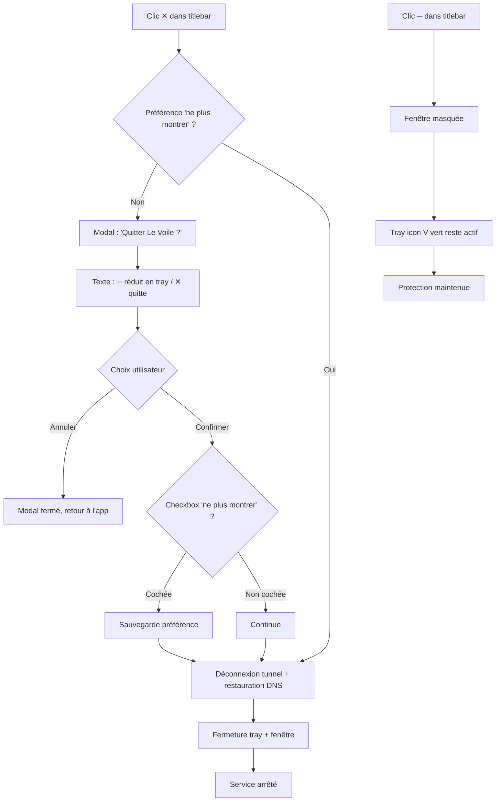
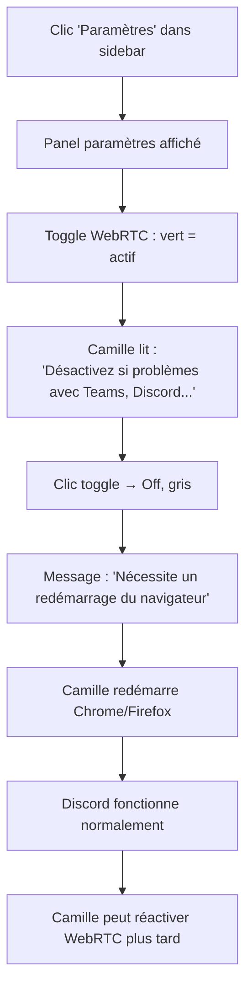

# UX Design Specification - Le Voile de Vélia

**Author:** Akerimus
**Date:** 2026-03-16

---

## Executive Summary

### Project Vision

Le Voile de Vélia est un VPN desktop zero-log par architecture, destiné au grand public francophone non-technique. La vision UX repose sur trois piliers : **zero-config** (protégé dès l'installation), **confiance prouvable** (vérification via plateformeliberte.fr/test-protection.html), et **invisibilité** (utilisation permanente en arrière-plan, oubliable).

Le produit répond à deux problèmes simultanés : le blocage imminent des VPN traditionnels en France, et l'impossibilité de vérifier les promesses zero-log des VPN existants. Le Voile résout le second par le design (relais stateless, code ouvert) et le premier par le camouflage protocolaire (QUIC/HTTPS via Cloudflare).

### Target Users

**Utilisateur principal — "Camille"**
- Grand public francophone, non-technique
- Sait installer un .exe, ne veut pas toucher aux réglages réseau
- Besoin : installer et oublier. Protection permanente sans action
- Motivation : méfiance envers les VPN classiques (promesses non vérifiables), inquiétude face au blocage VPN en France
- Moment "wow" attendu : installer Le Voile, aller sur plateformeliberte.fr/test-protection.html, voir une IP islandaise/allemande/finlandaise/US sans avoir rien configuré

**Utilisateur secondaire — "Akerimus" (opérateur)**
- Développeur technique, gère les relais VPS
- Besoin : déployer et monitorer les relais facilement
- Pas d'UI spécifique — interaction via CLI et fichiers de configuration

### Key Design Challenges

1. **Zero-config absolu** — Aucun écran de configuration. Le binaire se lance, le tunnel se connecte, la protection est active. Le moindre choix technique imposé à l'utilisateur est un échec UX
2. **Confiance par la transparence** — L'UI doit prouver la protection, pas la promettre. Affichage de l'IP visible en temps réel, lien vers la page de test indépendante, code source ouvert
3. **Invisibilité en fonctionnement normal** — Utilisation permanente = l'application doit être oubliable. Le system tray est le point d'accès principal. La fenêtre desktop est consultée occasionnellement (changement de pays, vérification)

### Design Opportunities

1. **Circuit de confiance immédiat** — Lien direct depuis l'UI vers plateformeliberte.fr/test-protection.html. Installation → vérification → confiance en moins de 30 secondes. Meilleur onboarding possible pour un produit de sécurité
2. **Cohérence visuelle totale avec plateformeliberte.fr** — Thème sombre navy (#0b1526), accents bleus luminescents (#1a6fc4, #2a8dff), rouge alerte (#d42b2b), typographies Bebas Neue (titres) / Rajdhani (UI) / Inter (corps). La fenêtre desktop est une extension naturelle du site
3. **Simplicité radicale de l'interface** — Le sélecteur de pays (4 pays : Islande, Allemagne, Finlande, US) avec drapeaux est la seule interaction significative. Le pays préféré est sauvegardé. Pas de paramètres avancés, pas de menus complexes

## Core User Experience

### Defining Experience

L'expérience définissante de Le Voile est **l'absence d'interaction**. Le produit réussit quand l'utilisateur l'oublie. L'action la plus fréquente est un coup d'œil au system tray pour confirmer que l'icône est verte. L'action occasionnelle est le changement de pays via le sélecteur de la fenêtre desktop.

Le Voile inverse le paradigme des VPN traditionnels : là où les concurrents demandent des choix (compte, protocole, serveur, paramètres), Le Voile élimine chaque décision. Pas de compte, pas de login, pas de choix de protocole, pas de paramètres réseau, pas d'abonnement.

### Platform Strategy

- **Desktop Windows** (MVP) — Binaire portable mono-processus Wails v3 (fenêtre + systray natif). WebView2 pour le rendu UI. Élévation UAC à chaque lancement
- **Linux / macOS** — Day one via cross-compilation Go + Wails v3. Binaire portable équivalent
- **Extension navigateur** — WebExtension Chrome MV3 + Firefox, installée automatiquement via politiques navigateur. Aucune action utilisateur
- **Interaction primaire** — Souris/clavier. Interface minimaliste, pas de scroll complexe, pas de formulaires
- **Offline** — Le registre des relais est caché localement. Le Voile peut redémarrer sans connexion internet initiale (cold start résilient)

### Effortless Interactions

| Interaction | Comportement attendu |
|---|---|
| Lancement | .exe → UAC → protégé. Zéro écran de configuration |
| Premier lancement | Tunnel connecté automatiquement au pays par défaut. IP étrangère visible immédiatement |
| Démarrage système | Raccourci Startup lance le binaire, UAC acceptée, tray affiché, tunnel reconnecté. Invisible |
| Changement de pays | Clic sur le drapeau dans la fenêtre. Reconnexion < 5s. Pays sauvegardé |
| Coupure réseau | Kill switch DNS instantané. Reconnexion automatique. Failover transparent |
| Extension navigateur | Installée automatiquement. Bypass gros fichiers automatique. Aucune config |
| Mise à jour | Téléchargement en arrière-plan. Notification tray. Appliquée au redémarrage |
| Crash processus | Watchdog DNS restaure le resolver < 5s. Crash-recovery au redémarrage < 5s |

### Critical Success Moments

1. **Premier lancement post-installation** (make-or-break) — L'utilisateur ouvre la fenêtre et voit : connecté, IP étrangère, pays avec drapeau. Si ce moment échoue (erreur, écran de choix, délai > 30s), l'utilisateur désinstalle
2. **Vérification sur test-protection.html** — L'utilisateur clique le lien dans l'UI, la page confirme que l'IP est masquée, DNS protégé, WebRTC sécurisé. Moment de confiance prouvée
3. **Coupure réseau transparente** — L'utilisateur change de Wi-Fi ou perd la connexion. Le Voile bascule silencieusement. L'utilisateur ne remarque rien — succès par absence de friction
4. **Changement de pays** — L'utilisateur veut apparaître depuis la France. Clic sur le drapeau, reconnexion rapide, IP française confirmée. Seule interaction active du produit

### Experience Principles

1. **Silence is success** — Le meilleur état de l'UI est celui que l'utilisateur ne regarde pas. La protection fonctionne sans attention
2. **Prove, don't promise** — Chaque élément d'interface prouve l'état de protection (IP visible, statut DNS, lien test). Jamais de promesse sans preuve vérifiable
3. **One click, one outcome** — Chaque interaction produit un résultat immédiat et visible. Pas de menus imbriqués, pas de confirmations, pas de paramètres
4. **Familiar by design** — L'UI reproduit l'identité visuelle de plateformeliberte.fr. L'utilisateur reconnaît immédiatement l'univers du produit

## Desired Emotional Response

### Primary Emotional Goals

- **Certitude vérifiée** — Remplacer la foi aveugle (modèle VPN classique) par une confiance prouvable. L'utilisateur ne croit pas que sa connexion est protégée, il le constate
- **Sérénité par l'oubli** — Le produit réussit quand l'utilisateur ne pense plus à sa protection. L'émotion cible en usage quotidien est l'absence totale d'inquiétude
- **Surprise par la simplicité** — Chaque étape éliminée (compte, config, protocole, paiement) génère un micro-moment de surprise positive

### Emotional Journey Mapping

| Étape | Émotion cible | Déclencheur |
|---|---|---|
| Découverte (plateformeliberte.fr) | Curiosité + soulagement | "Enfin un VPN qui prouve ses promesses" |
| Installation | Surprise | Pas de compte, pas de formulaire, UAC unique |
| Premier lancement | Confiance vérifiée | IP étrangère visible, test-protection.html tout vert |
| Usage quotidien | Sérénité | Icône tray verte, aucune intervention requise |
| Coupure réseau | Rien (absence d'anxiété) | Failover silencieux, l'utilisateur ne remarque rien |
| Erreur visible | Calme contrôlé | "Reconnexion..." avec indicateur clair, résolution automatique |
| Changement de pays | Satisfaction immédiate | Clic drapeau → IP changée en < 5s |
| Retour après absence | Reconnaissance | L'app tourne toujours, même pays, même protection |

### Micro-Emotions

**Critiques à cultiver :**
- **Confiance → pas Scepticisme** — Chaque élément d'UI prouve l'état réel (IP, DNS, WebRTC). Aucune affirmation sans preuve
- **Accomplissement → pas Frustration** — Le "succès" est atteint dès l'installation. Pas de courbe d'apprentissage
- **Calme → pas Anxiété** — Aucun jargon technique, aucun choix imposé, aucun message d'erreur cryptique

**À éviter absolument :**
- Anxiété technique ("est-ce que je dois configurer quelque chose ?")
- Doute ("est-ce que ça marche vraiment ?")
- Culpabilité ("est-ce que c'est légal ?")
- Abandon ("c'est trop compliqué")

### Design Implications

| Émotion cible | Implication UX |
|---|---|
| Certitude vérifiée | IP visible en permanence dans la fenêtre + lien test-protection.html accessible en un clic |
| Sérénité | System tray comme interface principale. Fenêtre optionnelle. Aucune notification intrusive |
| Surprise par la simplicité | Zéro écran de configuration. Le tunnel se connecte seul. L'extension s'installe seule |
| Calme en cas d'erreur | Messages en français non-technique ("Reconnexion en cours..." jamais "QUIC handshake timeout error") |
| Absence de culpabilité | Langage positif ("protection de votre vie privée") plutôt que défensif. Lien vers le cadre légal sur plateformeliberte.fr |

### Emotional Design Principles

1. **La preuve remplace la promesse** — Aucun texte marketing dans l'UI. Seulement des données vérifiables : IP visible, pays, statut DNS, lien de test indépendant
2. **Le silence est une émotion** — L'absence de notification, l'absence de choix, l'absence de friction sont des décisions de design intentionnelles qui génèrent la sérénité
3. **Le français humain, pas le jargon** — Tous les messages utilisateur en français courant. "Connecté — Islande" pas "QUIC tunnel established to is-01.levoile.dev:443"
4. **La légitimité par le design** — Thème sombre professionnel, cohérence avec plateformeliberte.fr, code source ouvert. L'esthétique inspire la confiance sans la demander

## UX Pattern Analysis & Inspiration

### Inspiring Products Analysis

**Mullvad VPN — Le plus proche philosophiquement**
- Pas de compte email, pas de mot de passe — juste un numéro de compte
- UI minimaliste : un bouton connect, un sélecteur de pays, c'est tout
- Pertinence : Le Voile va encore plus loin — même pas de numéro de compte. Radicalité du zero-friction
- Limite : Mullvad reste un VPN classique (OpenVPN/WireGuard détectable). Le Voile est invisible au DPI

**Signal — La confiance par le design**
- Open source, audité, protocole prouvé
- L'app ne demande rien de superflu. Pas de publicité, pas de tracking
- Le message implicite : "on n'a rien à cacher dans notre code"
- Pertinence : le positionnement "prouvez-le vous-même" + l'esthétique sobre qui inspire le sérieux

**f.lux / Night Light — L'app qu'on oublie**
- S'installe, se configure une fois, puis disparaît dans le tray
- On ne la remarque que quand elle est absente
- Pertinence : le pattern exact de Le Voile — install & forget, tray icon comme seul point de contact quotidien

**plateformeliberte.fr — L'identité propre du projet**
- Thème sombre navy (#0b1526), glow bleus (#1a6fc4, #2a8dff), typographies Bebas Neue / Rajdhani / Inter
- Page test-protection.html : score visuel circulaire, badges vert/orange/rouge, feedback immédiat par catégorie
- Pertinence : l'identité visuelle intégrale à reproduire. La fenêtre desktop est une extension naturelle du site

### Transferable UX Patterns

| Pattern | Source | Application dans Le Voile |
|---|---|---|
| Sélecteur de pays minimaliste | Mullvad | Drapeaux + nom de pays + nombre de relais. Pas de carte du monde |
| Badge de confiance open source | Signal | "Code source ouvert" visible dans l'UI, lien GitHub |
| Tray-first UX | f.lux | L'app vit dans le tray. La fenêtre est secondaire, consultée occasionnellement |
| Palette statut vert/orange/rouge | plateformeliberte.fr/test-protection.html | Réutiliser les badges de statut dans la fenêtre desktop pour cohérence |
| Score de protection visuel | plateformeliberte.fr/test-protection.html | Anneau ou indicateur visuel dans la fenêtre montrant l'état de protection |
| Zero-account | Mullvad (numéro) → Le Voile (rien) | Aucune création de compte, aucun identifiant, aucune donnée personnelle |

### Anti-Patterns to Avoid

| Anti-pattern | Vu dans | Pourquoi l'éviter |
|---|---|---|
| Création de compte obligatoire | NordVPN, ExpressVPN, CyberGhost | Friction massive, collecte de données, contradictoire avec zero-log |
| Dashboard surchargé (carte monde, stats, graphiques) | NordVPN, Surfshark | Complexité visuelle inutile, anxiogène pour un non-technique |
| Notifications push agressives ("Vous n'êtes pas protégé !") | Antivirus grand public | Génère l'anxiété au lieu de la sérénité |
| Choix de protocole (OpenVPN / WireGuard / IKEv2) | ProtonVPN, Mullvad | Jargon technique, décision impossible pour l'utilisateur cible |
| Upsell / premium / publicités internes | VPN gratuits | Détruit la confiance immédiatement |
| Kill switch désactivé par défaut | Nombreux VPN | Faux sentiment de sécurité. Le Voile : kill switch toujours actif, non désactivable |

### Design Inspiration Strategy

**Adopter directement :**
- Tray-first UX (f.lux) — le system tray est l'interface principale
- Zero-account radical (Mullvad → poussé plus loin) — aucun identifiant
- Palette de statut vert/orange/rouge (plateformeliberte.fr) — cohérence visuelle cross-produit

**Adapter au contexte Le Voile :**
- Sélecteur de pays Mullvad → enrichi avec drapeaux emoji et nombre de relais disponibles par pays
- Badge open source Signal → lien vers GitHub + lien vers test-protection.html
- Indicateur de score test-protection.html → version simplifiée intégrée dans la fenêtre desktop

**Éviter absolument :**
- Tout ce qui ressemble à un dashboard réseau (cartes, graphiques, statistiques)
- Toute forme de création de compte ou collecte de données
- Tout choix technique exposé à l'utilisateur (protocole, serveur spécifique, paramètres réseau)
- Toute notification anxiogène ou fréquente

## Design System Foundation

### Design System Choice

**CSS custom aligné sur plateformeliberte.fr — sans framework UI**

L'UI Wails v3 utilise du HTML/CSS/JS vanilla sans framework frontend ni bibliothèque de composants externe. L'identité visuelle de plateformeliberte.fr constitue le design system de référence.

### Rationale for Selection

1. **L'identité visuelle existe déjà** — plateformeliberte.fr définit la palette complète, les typographies, les composants (boutons, cards, badges), les effets (glow, gradients). Un framework UI ajouterait une couche d'abstraction à défaire
2. **Surface UI minimale** — Le Voile a ~3 vues : fenêtre principale (statut + sélecteur pays), état transitoire (reconnexion), notification de mise à jour. Pas besoin de 200 composants
3. **Cohérence cross-produit garantie** — Réutiliser les mêmes variables CSS et classes que le site assure une identité visuelle identique entre le site et le client desktop
4. **Performance optimale** — Zéro dépendance frontend. Wails + WebView2 + vanilla = empreinte minimale. Pas de bundle JS lourd pour une UI de 3 écrans
5. **Développeur unique** — Pas de courbe d'apprentissage framework. Le CSS du site est la documentation du design system

### Implementation Approach

- **Moteur de rendu :** Wails v3 + WebView2 (Windows), WebKit (Linux/macOS)
- **Frontend :** HTML/CSS/JS vanilla — pas de framework, pas de bundler
- **Communication Go ↔ UI :** Bindings Wails v3 directs (appels Go depuis JS, pas d'IPC inter-processus)
- **CSS :** Variables CSS (custom properties) extraites de plateformeliberte.fr pour les tokens de design
- **Assets :** Fonts embarquées (Bebas Neue, Rajdhani, Inter), icônes SVG inline

### Customization Strategy

**Design Tokens (variables CSS) :**

```css
:root {
  /* Backgrounds */
  --bg-primary: #0b1526;
  --bg-secondary: #0e1e38;
  --bg-tertiary: #162a4a;

  /* Accents */
  --accent-blue: #1a6fc4;
  --accent-glow: #2a8dff;
  --accent-red: #d42b2b;
  --accent-red-bright: #ff3c3c;

  /* Status */
  --status-secure: #4ade80;
  --status-warning: #fb923c;
  --status-risk: #ff3c3c;

  /* Text */
  --text-primary: #f0f4ff;
  --text-secondary: #8a9bb8;

  /* Typography */
  --font-heading: 'Bebas Neue', sans-serif;
  --font-ui: 'Rajdhani', sans-serif;
  --font-body: 'Inter', sans-serif;
}
```

**Composants nécessaires (exhaustif) :**
- Indicateur de statut (connecté/en cours/déconnecté) avec couleur et animation
- Sélecteur de pays (drapeaux + nom + nombre relais)
- Affichage IP visible
- Bouton connect/disconnect
- Lien "Tester ma protection" vers test-protection.html
- Message transitoire ("Reconnexion en cours...")
- Notification de mise à jour disponible

## Defining Core Experience

### Defining Experience

**"J'installe, je vérifie, c'est bon."**

L'interaction définissante de Le Voile n'est pas un geste dans l'app — c'est le **circuit de preuve** : installation → fenêtre ouverte → IP étrangère visible → test-protection.html → tout vert. Ce que Camille raconte à un ami : "Tu installes, tu vas sur le site, et tu vois que ça marche. Sans rien faire."

### User Mental Model

Camille pense "VPN" mais son modèle mental réel est plus proche d'un **antivirus** :
- On installe, ça tourne en fond, on n'y touche pas
- On vérifie de temps en temps que c'est vert
- On ne comprend pas le détail technique et on ne veut pas comprendre

Les VPN classiques imposent un modèle mental de "connexion active" (choisir un serveur, se connecter, vérifier). Le Voile supprime ce modèle — la protection est un **état permanent**, pas une action.

### Success Criteria

| Critère | Indicateur de succès |
|---|---|
| Premier lancement | IP étrangère visible en < 30s après installation |
| Vérification | test-protection.html confirme tout vert en un clic depuis l'UI |
| Usage quotidien | L'utilisateur ne pense pas à Le Voile. L'icône tray est le seul rappel |
| Coupure réseau | Failover silencieux. L'utilisateur ne remarque rien |
| Changement de pays | Clic drapeau → nouvelle IP en < 5s |

### Novel UX Patterns

**Innovation par soustraction** — Le Voile n'invente aucun nouveau pattern d'interaction. Il utilise des patterns ultra-familiers :
- Tray icon coloré = antivirus
- Fenêtre simple avec statut = météo, horloge
- Sélecteur de pays avec drapeaux = booking, compagnies aériennes

L'innovation est dans ce qui est **absent** : pas de login, pas de choix de protocole, pas de paramètres. C'est une innovation par soustraction.

**Tray Icon — "V" identitaire :**
- Fond bleu profond (#0b1526 / #0e1e38) cohérent avec la charte plateformeliberte.fr
- "V" stylisé (logo Le Voile) dont la couleur change selon l'état :
  - Vert (#4ade80) = connecté, protégé
  - Orange (#fb923c) = reconnexion en cours, transition
  - Rouge (#ff3c3c) = déconnecté, non protégé
- 3 variantes d'icône pré-générées (.ico), switchées dynamiquement via systray

### Experience Mechanics

**1. Circuit de preuve (premier lancement) :**
- Le binaire est lancé → UAC acceptée → la fenêtre Wails v3 s'ouvre automatiquement → l'icône tray apparaît (V vert)
- La fenêtre affiche : statut vert "Connecté", drapeau du pays (ex: Islande), relais actif (is-01), IP visible (ex: 82.221.xxx.xxx)
- Un lien "Tester ma protection" ouvre test-protection.html dans le navigateur par défaut
- La page confirme indépendamment : IP masquée, DNS protégé, WebRTC sécurisé
- L'utilisateur ferme la fenêtre. L'icône tray reste verte. C'est fini.

**2. Usage quotidien :**
- Le processus tourne. L'icône tray montre le V vert. Rien d'autre.
- Clic gauche sur le tray = toggle fenêtre (vérification rapide)
- Clic droit = menu contextuel (Ouvrir / Connecter-Déconnecter / Quitter)

**3. Changement de pays :**
- Ouverture fenêtre → clic sur le sélecteur → clic sur le drapeau voulu
- V orange pendant la reconnexion (< 5s)
- V vert + nouvelle IP affichée. Pays sauvegardé.

**4. Gestion d'erreur :**
- Perte de connexion → V orange, fenêtre affiche "Reconnexion en cours..." avec pulsation orange subtile
- Pas de message technique. Pas de bouton "Réessayer" — c'est automatique
- Connexion rétablie → retour au V vert, silencieusement
- Si aucun relais disponible → V rouge, message "Aucun relais disponible. Vérifiez votre connexion internet."

## Visual Design Foundation

### Color System

**Palette principale — alignée sur plateformeliberte.fr :**

| Rôle | Couleur | Hex | Usage |
|---|---|---|---|
| Background primaire | Navy profond | #0b1526 | Fond fenêtre, fond tray icon |
| Background secondaire | Navy moyen | #0e1e38 | Cards, zones surélevées |
| Background tertiaire | Navy clair | #162a4a | Hover, sélection active |
| Accent primaire | Bleu | #1a6fc4 | Boutons, liens, bordures actives |
| Accent glow | Bleu lumineux | #2a8dff | Glow effects, focus states |
| Alerte | Rouge | #d42b2b | Erreurs, états critiques |
| Alerte bright | Rouge vif | #ff3c3c | Statut déconnecté, V rouge tray |
| Texte primaire | Blanc bleuté | #f0f4ff | Titres, texte principal |
| Texte secondaire | Gris bleuté | #8a9bb8 | Labels, texte auxiliaire |

**Palette sémantique de statut :**

| État | Couleur | Hex | Contexte |
|---|---|---|---|
| Connecté / Protégé | Vert | #4ade80 | V tray, indicateur fenêtre, badges |
| En transition / Reconnexion | Orange | #fb923c | V tray, pulsation fenêtre |
| Déconnecté / Risque | Rouge | #ff3c3c | V tray, alerte fenêtre |

**Ratios de contraste (WCAG AA) :**
- #f0f4ff sur #0b1526 = ~15:1 (AAA)
- #4ade80 sur #0b1526 = ~10:1 (AAA)
- #fb923c sur #0b1526 = ~7:1 (AA)
- #ff3c3c sur #0b1526 = ~5:1 (AA)
- #8a9bb8 sur #0b1526 = ~5:1 (AA)

### Typography System

**Familles de polices :**

| Rôle | Police | Poids | Usage |
|---|---|---|---|
| Titres | Bebas Neue | 400 | Titre fenêtre "LE VOILE", en-têtes de section |
| UI / Navigation | Rajdhani | 500, 600, 700 | Boutons, labels, sélecteur pays, statut |
| Corps / Données | Inter | 400, 500 | IP visible, messages, texte auxiliaire |

**Échelle typographique :**

| Élément | Taille | Police | Poids | Line-height |
|---|---|---|---|---|
| Titre app | 28px | Bebas Neue | 400 | 1.1 |
| Statut principal | 18px | Rajdhani | 700 | 1.3 |
| Label pays / relais | 16px | Rajdhani | 600 | 1.3 |
| IP visible | 16px | Inter | 500 | 1.4 |
| Texte auxiliaire | 14px | Inter | 400 | 1.4 |
| Message transitoire | 14px | Rajdhani | 500 | 1.3 |
| Lien / action | 14px | Rajdhani | 600 | 1.3 |

**Polices embarquées** — Toutes les fonts sont bundlées dans le binaire Wails (pas de CDN, pas de dépendance réseau).

### Spacing & Layout Foundation

**Fenêtre Wails — dimensions compactes :**
- Taille : ~400 x 500px (compact, style widget)
- Non redimensionnable — contenu fixe, pas de scroll
- Centrée à l'ouverture, position mémorisée ensuite
- Apparence : sans bordure système (frameless), coins arrondis (8px)

**Système de spacing (base 8px) :**

| Token | Valeur | Usage |
|---|---|---|
| --space-xs | 4px | Gaps internes mineurs |
| --space-sm | 8px | Padding interne composants |
| --space-md | 16px | Espacement entre composants |
| --space-lg | 24px | Sections principales |
| --space-xl | 32px | Marges fenêtre |

**Principes de layout :**
- Layout vertical centré — flux naturel de haut en bas
- Contenu aéré — beaucoup d'espace blanc (navy) entre les éléments
- Pas de grille complexe — empilement simple de composants
- Hiérarchie visuelle claire : statut > pays/IP > actions > liens

**Effets visuels (cohérents plateformeliberte.fr) :**
- Bordures subtiles : 1px rgba(42, 141, 255, 0.15)
- Box-shadow glow sur focus/hover : 0 0 20px rgba(42, 141, 255, 0.2)
- Transitions douces : 200ms ease pour les changements d'état
- Pulsation orange pour l'état reconnexion : animation CSS keyframe

### Accessibility Considerations

- **Contraste :** Tous les couples texte/fond respectent WCAG AA minimum (ratio ≥ 4.5:1). Titres et statuts en AAA (≥ 7:1)
- **Couleur non-exclusive :** Les états ne reposent pas uniquement sur la couleur — le texte de statut ("Connecté", "Reconnexion...", "Déconnecté") accompagne toujours l'indicateur coloré
- **Taille minimale :** Aucun texte sous 14px. Zones cliquables minimum 44x44px (standard tactile, même en souris)
- **Focus visible :** Outline bleu glow (#2a8dff) sur tous les éléments interactifs au clavier (Tab navigation)
- **Polices lisibles :** Inter pour le texte de données (optimisée écran), Rajdhani pour l'UI (bonne lisibilité à petite taille)

## Design Direction Decision

### Design Directions Explored

6 directions de layout explorées pour la fenêtre Wails v3 (420×540px) :
- A — Centré Héroïque (anneau de statut central)
- B — Dashboard Compact (cards d'info structurées)
- C — Minimaliste Radical (grand drapeau, pills pays)
- D — Cards Modulaires (grille 2×2 pays)
- E — Focus Vertical (grand V lumineux, lecture verticale)
- F — Split Sidebar (sidebar pays à gauche, panel statut à droite)

Showcase interactif : `planning-artifacts/ux-design-directions.html`

### Chosen Direction

**Direction F — Split Sidebar** avec les ajustements suivants :

**Layout :**
- Sidebar gauche (150px) : onglet Paramètres en premier, séparateur, puis liste des pays
- Panel principal droit : statut, drapeau grand format, IP visible, relais, actions
- Titlebar custom : V identitaire (couleur = statut), nom app, boutons ─ (minimiser en tray) et ✕ (quitter)

**Sidebar — Organisation des pays :**
- Pays favori en tête de liste (s'il y en a un)
- Puis pays restants par ordre alphabétique (Allemagne, États-Unis, Finlande, Islande)
- Étoile jaune à droite de chaque pays :
  - Contour jaune par défaut
  - Jaune plein au hover
  - Clic = marquer comme favori (un seul favori à la fois), le pays remonte en tête
- Le pays actif est indiqué par un bord gauche bleu accent

**Sidebar — Onglet Paramètres :**
- Premier élément de la sidebar (avant les pays)
- Icône ⚙ + label "Paramètres"
- Contenu du panel quand sélectionné :
  - **Protection WebRTC** : toggle on/off (vert = actif, gris = inactif — pas de badge texte redondant)
  - Description : "Empêche les sites web de découvrir votre adresse IP réelle via WebRTC"
  - Conseil : "Désactivez si vous rencontrez des problèmes avec Teams, Discord, ou les appels vidéo dans le navigateur"
  - Avertissement : "Nécessite un redémarrage du navigateur" (texte orange)

**Contrôles fenêtre (titlebar) :**
- **─ (minimiser)** : réduit la fenêtre dans le tray. Le processus et la protection restent actifs
- **✕ (quitter)** : déclenche un modal d'avertissement :
  - Titre : "Quitter Le Voile ?"
  - Texte : "Utilisez ─ pour réduire la fenêtre en icône tray. ✕ déconnecte le VPN et quitte Le Voile. Votre connexion ne sera plus protégée."
  - Checkbox : "Ne plus montrer" (préférence persistée)
  - Boutons : Annuler / Confirmer
- Les symboles ─ et ✕ sont affichés en gras (font-weight: 700, 16px) pour une bonne lisibilité

**États visuels documentés :**
1. **Connecté** — V vert, dot vert, drapeau plein, IP affichée
2. **Reconnexion** — V orange (titlebar), dot pulsant orange, drapeau atténué (opacity 0.6), IP "—", message "Basculement vers un autre relais..."
3. **Déconnecté** — V rouge, dot rouge, message "Aucun relais disponible"
4. **Paramètres** — Panel paramètres affiché à la place du panel statut
5. **Modal quitter** — Overlay sombre avec blur, modal centré

### Design Rationale

1. **Split sidebar = navigation spatiale intuitive** — Les pays sont toujours visibles, un clic suffit pour changer. Pas de dropdown, pas de menu imbriqué
2. **Paramètres en sidebar** — Intégrés naturellement dans la navigation au lieu d'un menu séparé. Un seul paramètre (WebRTC) pour l'instant, extensible plus tard
3. **Favoris par étoile** — Pattern universel (email, fichiers, navigateurs). Le favori est sauvegardé et reconnecté au démarrage
4. **Modal ✕ pédagogique** — Éduque l'utilisateur sur la différence ─ vs ✕ sans bloquer. "Ne plus montrer" respecte les utilisateurs expérimentés
5. **Titlebar custom avec V** — Cohérence avec le tray icon (V qui change de couleur). Le statut est visible même dans la titlebar

### Implementation Approach

- Fenêtre Wails v3 frameless avec titlebar HTML custom (drag region sur la zone titre)
- Sidebar et panel principal en CSS flexbox
- 3 vues pour le panel droit : statut pays (défaut), paramètres, modal quitter (overlay)
- Icônes tray : 3 fichiers .ico pré-générés (V vert, V orange, V rouge) switchés via Go systray
- Préférences persistées en JSON local : pays favori, "ne plus montrer" modal, état WebRTC

## User Journey Flows

### J1 — Installation et premier lancement

**Contexte PRD :** Camille télécharge le binaire portable depuis plateformeliberte.fr.



**Points UX clés :**
- Pas d'installation — un binaire portable lancé directement
- La fenêtre s'ouvre *automatiquement* — Camille n'a rien à chercher
- Le lien "Tester ma protection" est le call-to-action du premier lancement
- Le ─ est le geste naturel de sortie (pas le ✕)

### J2 — Changement de pays

**Contexte PRD :** Camille veut apparaître depuis l'Allemagne.



**Points UX clés :**
- Clic sur un pays différent = affiche le panel avec bouton "Connecter" vert (pas d'auto-connexion)
- L'utilisateur confirme explicitement le changement → évite toute déconnexion non désirée
- Transition visuelle V vert → V orange → V vert (< 5s) après clic "Connecter"

### J3 — Coupure réseau et failover

**Contexte PRD :** Le Wi-Fi du café tombe. Camille ne doit rien remarquer.



**Points UX clés :**
- Camille ne fait RIEN — tout est automatique
- Si la fenêtre est fermée, seul le tray change de couleur
- Le kill switch DNS empêche toute fuite pendant la bascule

### J4 — Quitter vs Minimiser

**Contexte :** Camille clique ✕ pour la première fois.



**Points UX clés :**
- Le ─ est le geste "normal" — réduire dans le tray, protection maintenue
- Le ✕ est destructif — il coupe la protection. D'où le modal pédagogique
- "Ne plus montrer" respecte les utilisateurs expérimentés

### J5 — Toggle WebRTC

**Contexte :** Camille a des problèmes avec Discord dans le navigateur.



**Points UX clés :**
- Seul paramètre exposé — pas de surcharge cognitive
- Explication contextuelle claire (Teams, Discord = cas concrets)
- Avertissement redémarrage navigateur en orange
- Pas de badge texte — le toggle vert/gris suffit

### Journey Patterns

| Pattern | Utilisé dans | Description |
|---|---|---|
| Transition V vert → orange → vert | J1, J2, J3 | Feedback visuel uniforme pour toute transition de connexion |
| Action automatique silencieuse | J1, J3 | Le système agit sans demander. L'utilisateur observe, pas décide |
| Clic = action immédiate | J2, J5 | Un clic sur un pays ou un toggle produit un effet instantané. Pas de confirmation |
| Fenêtre optionnelle | J3 | Le comportement est identique que la fenêtre soit ouverte ou non |
| Modal pédagogique unique | J4 | Avertissement une fois, option "ne plus montrer" |

### Flow Optimization Principles

1. **Zéro confirmation sauf destruction** — Changer de pays = un clic. Toggle WebRTC = un clic. Seule action avec confirmation : quitter (✕), car elle détruit la protection
2. **Feedback visuel uniforme** — Toute transition de connexion suit le même pattern V vert → orange → vert. L'utilisateur apprend le code couleur une fois
3. **Fenêtre optionnelle** — Tous les flows fonctionnent identiquement que la fenêtre soit ouverte ou fermée. Le tray est suffisant
4. **Recovery automatique** — Aucun bouton "Réessayer". Le système résout les problèmes seul. L'utilisateur n'intervient que si internet est physiquement coupé

## Component Strategy

### Design System Components

Pas de design system externe. Tous les composants sont custom, construits en HTML/CSS/JS vanilla avec les design tokens de plateformeliberte.fr. La bibliothèque de composants est le fichier CSS unique de l'application.

### Custom Components

#### C1 — Titlebar Custom

**Purpose :** Barre de titre frameless avec identité Le Voile et contrôles fenêtre
**Anatomy :** V identitaire (couleur = statut) | "Le Voile" (texte) | zone drag | cloche notifications (C11) | ─ (minimiser) | ✕ (quitter)
**States :**
- Connecté : V vert (#4ade80)
- Reconnexion : V orange (#fb923c) pulsant
- Déconnecté : V rouge (#ff3c3c)

**Interaction :** Zone titre = drag fenêtre. ─ = masquer en tray. ✕ = modal quitter.
**Accessibilité :** Boutons ─ et ✕ focusables au clavier (Tab), aria-label "Réduire" et "Quitter"

#### C2 — Sidebar Navigation

**Purpose :** Navigation latérale avec onglet paramètres + liste de pays
**Anatomy :** Tab paramètres (⚙) | séparateur | pays favori (si défini) | pays alphabétiques
**States :**
- Tab/pays inactif : fond transparent
- Tab/pays hover : fond tertiary (#162a4a)
- Tab/pays actif : fond tertiary + bord gauche bleu accent (#2a8dff)

**Dimensions :** 150px largeur fixe, hauteur = fenêtre
**Accessibilité :** Navigation au clavier (flèches haut/bas), aria-current sur le pays actif

#### C3 — Country Item (sidebar)

**Purpose :** Élément pays dans la sidebar avec drapeau, nom et étoile favori
**Anatomy :** Drapeau emoji (16px) | nom pays | étoile favori
**States :**
- Défaut : texte primaire, étoile contour jaune
- Hover : fond tertiary, étoile jaune plein
- Actif : fond tertiary + bord gauche bleu
- Favori : étoile jaune plein, pays en tête de liste

**Interaction :** Clic nom = sélectionner pays. Clic étoile = toggle favori.
**Accessibilité :** aria-label "Sélectionner [pays]", aria-label "Marquer [pays] comme favori"

#### C4 — Star Favorite

**Purpose :** Indicateur/toggle favori sur chaque pays
**Anatomy :** Étoile (★) 14px
**States :**
- Défaut : contour jaune (#facc15), transparent intérieur
- Hover : jaune plein
- Favori actif : jaune plein permanent

**Interaction :** Clic = toggle. Un seul favori à la fois (le précédent est retiré).
**Accessibilité :** role="switch", aria-checked, aria-label

#### C5 — Status Panel (main)

**Purpose :** Panel principal affichant l'état de connexion
**Anatomy :** Status group (dot + texte) | grand drapeau (56px) | nom pays (Bebas Neue 28px) | IP visible | relais + latence | bouton déconnecter | lien tester
**States :**
- Connecté : dot vert, texte "Connecté", drapeau plein, IP affichée, bouton "Déconnecter"
- Reconnexion : dot orange pulsant, texte "Reconnexion...", drapeau opacity 0.6, IP "—", sous-texte "Basculement vers un autre relais..."
- Déconnecté : dot rouge, texte "Déconnecté", bouton "Connecter" (vert)
- Pays sélectionné (différent du connecté) : drapeau du nouveau pays, nom pays, bouton "Connecter" (vert), pas d'IP
- Erreur : dot rouge, texte "Aucun relais disponible", pas de bouton

**Accessibilité :** aria-live="polite" sur le statut pour annoncer les changements aux lecteurs d'écran

#### C6 — Settings Panel

**Purpose :** Panel paramètres avec toggle WebRTC
**Anatomy :** Titre "PARAMÈTRES" (Bebas Neue) | groupe WebRTC (label + description + avertissement + toggle) | lien tester
**States :** Affiché quand onglet paramètres sélectionné dans la sidebar
**Accessibilité :** Toggle avec role="switch", aria-checked, aria-label

#### C7 — Toggle Switch

**Purpose :** Interrupteur on/off pour les paramètres
**Anatomy :** Piste (40×22px, border-radius 11px) | bouton circulaire (16px)
**States :**
- On : piste verte (#4ade80 à 30%), bouton vert, position droite
- Off : piste grise (#162a4a), bouton gris, position gauche
- Hover : légère augmentation d'opacité

**Interaction :** Clic = toggle instantané. Pas de confirmation.
**Accessibilité :** role="switch", aria-checked, focusable Tab, toggle Espace/Entrée

#### C8 — Quit Modal

**Purpose :** Modal d'avertissement quand l'utilisateur clique ✕
**Anatomy :** Overlay sombre (85% opacité + blur 4px) | modal card (300px max) : titre + texte + checkbox "Ne plus montrer" + boutons Annuler/Confirmer
**States :**
- Affiché : overlay + modal centré, contenu derrière atténué (opacity 0.3)
- Masqué : invisible

**Interaction :** Annuler = ferme modal. Confirmer = déconnecte + quitte. Esc = annuler.
**Accessibilité :** Focus trap dans le modal, aria-modal="true", focus initial sur "Annuler"

#### C9 — Status Dot

**Purpose :** Indicateur circulaire de statut (réutilisé dans titlebar, panel, tray)
**Anatomy :** Cercle 12px avec glow
**States :**
- Connecté : vert (#4ade80), glow vert
- Reconnexion : orange (#fb923c), glow orange, animation pulse 1.5s
- Déconnecté : rouge (#ff3c3c), glow rouge

**Accessibilité :** Toujours accompagné de texte — ne sert pas seul

#### C10 — Action Link

**Purpose :** Lien d'action secondaire ("Tester ma protection ↗")
**Anatomy :** Texte Rajdhani 600 14px + flèche ↗
**States :**
- Défaut : couleur accent glow (#2a8dff)
- Hover : souligné
- Focus : outline glow bleu

**Interaction :** Ouvre l'URL dans le navigateur par défaut (pas dans la WebView)
**Accessibilité :** `<a>` standard avec target="_blank", rel="noopener"

#### C11 — Notification Bell

**Purpose :** Indicateur de notifications non lues dans la titlebar
**Anatomy :** Icône cloche (16px) | badge orange avec chiffre (si notifications non lues)
**Position :** Titlebar, à gauche des boutons ─ et ✕
**States :**
- Pas de notification : cloche grise (#8a9bb8), pas de badge
- Notification(s) non lue(s) : cloche blanche (#f0f4ff), badge orange (#fb923c) avec chiffre
- Hover : légère augmentation d'opacité

**Interaction :** Clic = affiche le panel notifications (remplace le panel principal). Clic à nouveau ou clic sur un pays = retour au panel statut.
**Notifications supportées :** Mise à jour disponible, alerte sécurité (futur)
**Accessibilité :** aria-label "Notifications", aria-live sur le badge

#### C12 — Connect Button

**Purpose :** Bouton d'action positive pour se connecter à un pays
**Anatomy :** Bouton vert, texte "Connecter", Rajdhani 600
**States :**
- Défaut : fond vert (#4ade80), texte navy (#0b1526)
- Hover : vert plus lumineux, glow vert subtil (box-shadow 0 0 16px rgba(74, 222, 128, 0.3))
- Disabled : opacity 0.5 (pendant la transition)

**Visible quand :**
- L'utilisateur est déconnecté (après clic "Déconnecter")
- L'utilisateur a sélectionné un pays différent du pays actuellement connecté

**Accessibilité :** aria-label "Se connecter à [pays]"

### Component Implementation Strategy

- **Fichier unique :** Tous les composants dans un seul CSS (~300 lignes estimées) + un seul JS (~200 lignes)
- **Pas de bundler :** HTML/CSS/JS servis directement par Wails embed
- **Tokens CSS :** Variables :root partagées entre tous les composants (couleurs, spacing, typos)
- **Communication Go ↔ JS :** Wails bindings pour le statut, les événements, les préférences

### Implementation Roadmap

**Phase 1 — MVP Core (bloquant) :**
- C1 Titlebar, C2 Sidebar, C3 Country Item, C5 Status Panel, C9 Status Dot
- Raison : le flow J1 (premier lancement) et J2 (changement pays) en dépendent

**Phase 2 — Interactions complètes :**
- C4 Star Favorite, C7 Toggle Switch, C8 Quit Modal, C10 Action Link, C12 Connect Button
- Raison : J4 (quitter vs minimiser), flow de connexion explicite, confort d'usage

**Phase 3 — Paramètres & Notifications :**
- C6 Settings Panel (avec toggle WebRTC), C11 Notification Bell
- Raison : J5 (toggle WebRTC), notifications mise à jour, peut être livré après le MVP core

## UX Consistency Patterns

### Button Hierarchy

**Action primaire positive :**
- Style : fond vert (#4ade80), texte navy (#0b1526), Rajdhani 600
- Hover : vert plus lumineux, glow vert subtil
- Usage : "Connecter" — visible uniquement quand déconnecté ou quand un pays différent est sélectionné
- Règle : un seul bouton vert par écran

**Actions destructives :**
- Style : transparent, texte rouge (#d42b2b), bordure rouge 30% opacité
- Hover : fond rouge 10% opacité, bordure rouge pleine
- Usage : "Déconnecter", "Confirmer" (quitter)
- Règle : une seule action destructive visible par écran

**Actions secondaires (annuler, retour) :**
- Style : transparent, texte secondaire (#8a9bb8), bordure bleu 20% opacité
- Hover : bordure bleu glow, texte primaire
- Usage : "Annuler" dans le modal

**Liens d'action :**
- Style : texte bleu glow (#2a8dff), Rajdhani 600, pas de soulignement
- Hover : soulignement
- Usage : "Tester ma protection ↗"
- Règle : toujours suffixé ↗ si ouvre un lien externe

### Feedback Patterns

**Transitions de connexion (pattern uniforme) :**

| Phase | Dot | V titlebar | Texte panel | IP | Action visible |
|---|---|---|---|---|---|
| Connecté | Vert glow | Vert | "Connecté" | IP visible | Bouton "Déconnecter" |
| Transition | Orange pulse | Orange | "Reconnexion..." | "—" | Aucun bouton |
| Déconnecté | Rouge glow | Rouge | "Déconnecté" | "—" | Bouton "Connecter" (vert) |
| Pays sélectionné (différent) | — | Couleur actuelle | Nom du pays | — | Bouton "Connecter" (vert) |
| Erreur | Rouge glow | Rouge | "Aucun relais disponible" | "—" | Aucun bouton |

**Règles de feedback :**
- Jamais de notification système (toast, popup Windows)
- Jamais de son
- Jamais de message technique (pas de codes d'erreur, pas de noms de protocoles)
- Le feedback est **visuel et passif** — l'utilisateur le voit s'il regarde, mais n'est jamais interrompu

**Notifications in-app (cloche) :**
- Icône cloche dans la titlebar (à gauche des boutons ─ et ✕)
- Badge orange avec chiffre si notifications non lues (ex: "1")
- Clic sur la cloche = panel notifications (remplace temporairement le panel principal)
- Types de notifications :
  - Mise à jour disponible : "Mise à jour prête — appliquée au prochain démarrage"
  - Alerte sécurité (futur) : "Fuite WebRTC détectée — protection renforcée"
- Les notifications sont marquées comme lues au clic
- Le badge disparaît quand toutes sont lues

### Navigation Patterns

**Sidebar comme navigation unique :**
- Pas de menu hamburger, pas de header nav, pas de tabs dans le panel
- La sidebar est le seul point de navigation
- Clic sur le pays actuellement connecté = affiche le panel statut (pas de changement)
- Clic sur un pays différent = affiche le panel statut de ce pays avec bouton "Connecter" vert (pas d'auto-connexion)
- Clic sur Paramètres = panel paramètres

**Logique de sélection pays :**
- Cliquer sur un pays ne connecte PAS automatiquement
- Si le pays cliqué est le pays actuellement connecté → panel statut normal ("Connecté", bouton "Déconnecter")
- Si le pays cliqué est différent → panel statut en attente : drapeau du nouveau pays, bouton "Connecter" vert, pas encore d'IP
- L'utilisateur confirme en cliquant "Connecter" → transition V orange → V vert
- Cela évite toute déconnexion non désirée

**Tray comme point d'entrée :**
- Clic gauche tray = toggle fenêtre (visible/masquée)
- Clic droit tray = menu contextuel minimal : Ouvrir | Connecter/Déconnecter | Quitter

### Modal Pattern

**Un seul modal dans toute l'app : le modal quitter.**

**Règles :**
- Overlay sombre 85% + blur 4px
- Contenu derrière atténué (opacity 0.3, pointer-events none)
- Focus trap (Tab reste dans le modal)
- Esc = Annuler
- Focus initial sur "Annuler" (action sûre)
- "Ne plus montrer" = préférence persistée

**Anti-pattern : pas de modal de confirmation pour changer de pays ou toggle WebRTC.** Ces actions sont immédiates et réversibles.

### Loading & Empty States

**Pas d'état "vide"** — Le Voile a toujours des relais dans le registre caché. Si le registre est corrompu, il est ignoré et re-téléchargé depuis un relais (cas exceptionnel géré côté Go).

**État de chargement initial :**
- Au lancement, avant la première connexion : V orange dans titlebar, panel affiche "Connexion en cours..." avec dot orange pulsant
- Pas de skeleton, pas de spinner — juste le pattern orange pulsant standard

**Pas de barre de progression** — Les transitions sont < 5s. Une animation pulse suffit.

### Text & Language Patterns

**Langue :** Français uniquement (public cible francophone)
**Ton :** Informatif, calme, non-technique
**Règles :**
- Pas de points d'exclamation (sauf erreur critique)
- Pas de majuscules agressives (sauf titres Bebas Neue qui sont naturellement uppercase)
- Noms de pays en français ("États-Unis" pas "USA", "Allemagne" pas "Germany")
- Messages d'erreur = description de la situation + suggestion, jamais un code technique

**Exemples :**
- "Connecté — Islande" (pas "Connected to is-01.levoile.dev:443")
- "Reconnexion en cours..." (pas "QUIC handshake failed, retrying...")
- "Aucun relais disponible. Vérifiez votre connexion internet." (pas "Error: all relays unreachable, timeout 3000ms")

## Responsive Design & Accessibility

### Responsive Strategy

**Le Voile n'est pas responsive au sens classique.** La fenêtre Wails est fixe (420×540px), non redimensionnable, frameless. Il n'y a pas de version mobile ni tablette.

**Adaptation cross-plateforme :**

| Plateforme | Moteur WebView | Particularités |
|---|---|---|
| Windows 10/11 | WebView2 (Chromium) | Référence de développement. Rendu pixel-perfect |
| Linux | WebKitGTK | Vérifier le rendu des fonts (Bebas Neue, Rajdhani, Inter). Fonts embarquées obligatoires |
| macOS | WebKit (Safari) | Vérifier le rendu des animations CSS. Tester les coins arrondis frameless |

**Points d'attention cross-plateforme :**
- Fonts embarquées dans le binaire (pas de CDN) → rendu identique partout
- Tester le DPI scaling (125%, 150%, 200%) sur Windows — les dimensions CSS doivent rester cohérentes
- Le system tray se comporte différemment sur chaque OS : tester clic gauche/droit, tooltip, icônes .ico vs .png

### Breakpoint Strategy

**Pas de breakpoints.** Fenêtre fixe. Un seul layout. Pas de media queries.

La seule adaptation nécessaire est le **DPI scaling** :
- Utiliser des unités `px` pour la fenêtre (taille fixe) mais `rem` pour les éléments internes
- Le WebView hérite du scaling OS — vérifier que 420×540px reste lisible à 200% DPI
- Si nécessaire : ajuster la taille fenêtre proportionnellement au DPI

### Accessibility Strategy

**Niveau cible : WCAG AA**

L'app est minimale, ce qui facilite l'accessibilité. Pas de formulaires complexes, pas de tableaux de données, pas de contenu dynamique lourd.

**Checklist accessibilité Le Voile :**

| Critère | Implémentation | Statut design |
|---|---|---|
| Contraste texte (4.5:1 min) | Tous les couples validés (section Visual Foundation) | Conçu |
| Contraste éléments UI (3:1 min) | Boutons, bordures, toggles vérifiés | Conçu |
| Couleur non-exclusive | Texte accompagne toujours la couleur de statut | Conçu |
| Taille cibles cliquables (44×44px) | Sidebar items, boutons, toggle, titlebar buttons | Conçu |
| Navigation clavier | Tab entre les éléments, Espace/Entrée pour activer | À implémenter |
| Focus visible | Outline bleu glow sur focus clavier | Conçu |
| Lecteur d'écran | aria-live sur statut, aria-labels sur tous les boutons | À implémenter |
| Focus trap modal | Tab reste dans le modal quitter quand ouvert | À implémenter |
| Skip content | Non nécessaire (pas de navigation longue) | N/A |

**Navigation clavier complète :**
- Tab : parcourt titlebar buttons → sidebar items → panel actions
- Flèches haut/bas : navigue dans la sidebar
- Entrée/Espace : active l'élément focusé
- Esc : ferme le modal / retour

### Testing Strategy

**Tests visuels cross-plateforme :**
- Windows 10 + Windows 11 : WebView2, DPI 100%/125%/150%/200%
- Ubuntu (dernier LTS) : WebKitGTK
- macOS (dernière version) : WebKit

**Tests accessibilité :**
- Outil automatisé : axe-core intégré en dev (vérification WCAG AA)
- Navigation clavier manuelle : vérifier que chaque action est atteignable sans souris
- Lecteur d'écran : NVDA (Windows), Orca (Linux), VoiceOver (macOS)
- Simulation daltonisme : vérifier que vert/orange/rouge restent distinguables en protanopie et deutéranopie

**Tests terrain :**
- Tests avec les amis d'Akerimus (mentionnés dans le PRD) sur leurs machines réelles

### Implementation Guidelines

- **HTML sémantique :** `<nav>` pour la sidebar, `<main>` pour le panel, `<button>` pour les actions (pas de `<div onclick>`)
- **ARIA :** aria-current="page" sur le pays actif, aria-live="polite" sur le statut, aria-modal="true" sur le modal
- **Focus :** outline personnalisé (glow bleu #2a8dff), jamais `outline: none` sans alternative
- **Fonts :** Toutes embarquées via @font-face, pas de dépendance réseau
- **DPI :** Tester à chaque commit sur au moins 2 niveaux DPI (100% et 150%)
