# UX Design Specification - Le Voile de Vélia

**Author:** Akerimus
**Date:** 2026-03-16

---

## Executive Summary

### Project Vision

Le Voile de Vélia est un VPN desktop zero-log par architecture, destiné au grand public francophone non-technique. La vision UX repose sur trois piliers : **zero-config** (protégé dès l'installation), **confiance prouvable** (vérification via plateformeliberte.fr/test-protection.html), et **invisibilité** (utilisation permanente en arrière-plan, oubliable).

Le produit répond à deux problèmes simultanés : le blocage imminent des VPN traditionnels en France, et l'impossibilité de vérifier les promesses zero-log des VPN existants. Le Voile résout le second par le design (relais stateless, code ouvert) et le premier par le camouflage protocolaire (QUIC/HTTPS via Cloudflare).

### Target Users

**Utilisateur principal — "Camille"**
- Grand public francophone, non-technique
- Sait installer un .exe, ne veut pas toucher aux réglages réseau
- Besoin : installer et oublier. Protection permanente sans action
- Motivation : méfiance envers les VPN classiques (promesses non vérifiables), inquiétude face au blocage VPN en France
- Moment "wow" attendu : installer Le Voile, aller sur plateformeliberte.fr/test-protection.html, voir une IP étrangère (Allemagne, Espagne, Royaume-Uni ou États-Unis) sans avoir rien configuré

**Utilisateur secondaire — "Akerimus" (opérateur)**
- Développeur technique, gère les relais VPS
- Besoin : déployer et monitorer les relais facilement
- Pas d'UI spécifique — interaction via CLI et fichiers de configuration

**Utilisatrice principale Phase 2 — "Léa" (Android)**
- 29 ans, communicante, Pixel 7 (Android 14, API 34)
- Cherche un VPN simple sur mobile, refus catégorique des apps qui demandent un compte ou collectent des données
- Découvre Le Voile via plateformeliberte.fr → page Android. Hésite entre F-Droid (recommandé) et APK direct GitHub releases
- Besoin : protection permanente sur mobile, sans technique. Tolérance zéro pour les permissions invasives
- Moment "wow" attendu : ouvrir l'app, voir « Connecté — Allemagne », fermer le téléphone, vérifier whatismyip.com via Chrome → IP allemande confirmée. Notification persistante dans la barre de statut Android la rassure en permanence sans être intrusive
- Particularité Android : doit activer un réglage OS (« VPN permanent + bloquer connexions sans VPN ») au premier lancement pour bénéficier du kill switch — l'onboarding doit la guider sans la perdre

### Key Design Challenges

1. **Zero-config absolu** — Aucun écran de configuration. Le binaire se lance, le tunnel se connecte, la protection est active. Le moindre choix technique imposé à l'utilisateur est un échec UX
2. **Confiance par la transparence** — L'UI doit prouver la protection, pas la promettre. Affichage de l'IP visible en temps réel, lien vers la page de test indépendante, code source ouvert
3. **Invisibilité en fonctionnement normal** — Utilisation permanente = l'application doit être oubliable. Le system tray est le point d'accès principal. La fenêtre desktop est consultée occasionnellement (changement de pays, vérification)

### Design Opportunities

1. **Circuit de confiance immédiat** — Lien direct depuis l'UI vers plateformeliberte.fr/test-protection.html. Installation → vérification → confiance en moins de 30 secondes. Meilleur onboarding possible pour un produit de sécurité
2. **Cohérence visuelle totale avec plateformeliberte.fr** — Thème sombre navy (#0b1526), accents bleus luminescents (#1a6fc4, #2a8dff), rouge alerte (#d42b2b), typographies Bebas Neue (titres) / Rajdhani (UI) / Inter (corps). La fenêtre desktop est une extension naturelle du site
3. **Simplicité radicale de l'interface** — Le sélecteur de pays (4 pays : Allemagne, Espagne, Royaume-Uni, États-Unis) avec drapeaux est la seule interaction significative. Le pays préféré est sauvegardé. Paramètres avancés minimaux et accessibles via une section dédiée (toggle WebRTC, option IPv6 hors tunnel FR8d, mode dégradé kill switch FR16b) — masqués derrière un bouton "Avancé" pour ne pas alourdir le flow principal

## Core User Experience

### Defining Experience

L'expérience définissante de Le Voile est **l'absence d'interaction**. Le produit réussit quand l'utilisateur l'oublie. L'action la plus fréquente est un coup d'œil à l'indicateur de statut résident — **system tray** sur desktop (icône V verte/orange/rouge), **notification persistante de la barre de statut Android** sur mobile (titre + pays + IP). L'action occasionnelle est le changement de pays via le sélecteur (sidebar desktop / bottom-sheet Android).

Le Voile inverse le paradigme des VPN traditionnels : là où les concurrents demandent des choix (compte, protocole, serveur, paramètres), Le Voile élimine chaque décision. Pas de compte, pas de login, pas de choix de protocole, pas de paramètres réseau, pas d'abonnement.

**Particularité Android — le rôle du tray** : sur desktop, le tray est l'interface principale. Sur Android, le concept de tray n'existe pas — son équivalent fonctionnel est la **notification persistante du Foreground Service** (`LeVoileVpnService`). Cette notification est ongoing, non-dismissable, importance LOW (silencieuse, pas de son ni vibration), et reste visible tant que le tunnel est actif — y compris après que l'utilisatrice ait fermé l'app par swipe. Elle joue trois rôles simultanés : indicateur de statut permanent, accès rapide à l'app (tap → réouvre `MainActivity`), bouton de déconnexion (action « Déconnecter »).

### Platform Strategy

**Desktop (MVP — Windows + Linux)**
- Architecture 2 processus : service privilégié (SCM Windows / systemd Linux via kardianos/service) + UI unique (`fyne.io/systray` + `webview/webview` dans un seul binaire). Communication IPC via named pipes (Windows) / Unix sockets (Linux)
- Fenêtre webview frameless 420×540px non redimensionnable + tray icon résident. Élévation UAC (Windows) / capabilities `CAP_NET_ADMIN` via systemd `AmbientCapabilities=` (Linux)
- Distribution : installeur NSIS (Windows), paquets natifs `.deb`/`.rpm`/`.apk`/AUR via GoReleaser + nfpm (Linux)
- macOS : différé Phase 3 (support utun via `wireguard/tun` possible mais non prioritaire)

**Android (Phase 2 — API 29+)**
- Architecture mono-processus : `MainActivity` (WebView Android plein écran, charte visuelle identique desktop) + `LeVoileVpnService` (Foreground Service + `android.net.VpnService`) + bridge JNI vers le noyau Go partagé via gomobile (`.aar`)
- **Pas de fenêtre fixe** — la WebView occupe tout l'écran, layout responsive mobile (sélecteur pays vertical, pas de sidebar, boutons tactiles ≥ 48dp). Cible : Pixel 6+ ou équivalent
- **Pas de tray** — le rôle du tray desktop est joué par la **notification persistante du Foreground Service** dans la barre de statut Android (channel `levoile_vpn_status`, importance LOW, ongoing non-dismissable, action « Déconnecter »)
- **Kill switch délégué OS** — activé via le réglage utilisateur Android « VPN permanent + bloquer connexions sans VPN ». Onboarding obligatoire au premier lancement avec deeplink `Settings.ACTION_VPN_SETTINGS`
- Distribution : F-Droid (build reproductible obligatoire, hash SHA256 identique entre 2 builds successifs depuis le même tag git) + APK direct GitHub releases (signé v2/v3 par master key Ed25519, vérifié par `PackageManager` au install). Pas de Google Play en MVP/Phase 2
- Hors scope explicite : iOS, Android TV, Wear OS, Android Auto. Tablettes Android standard couvertes par la WebView responsive (pas de layout dédié tablette)

**Cross-OS — principes communs**
- **Isolation OS maximale** (ADR-08) : pas de mutualisation des composants UI desktop ↔ Android. Duplication assumée. Seul le strict noyau protocole/crypto/registre/session est partagé via gomobile (5 packages Go)
- **Charte visuelle identique** sur les 3 OS (palette, typographies, composants visuels) — l'identité plateformeliberte.fr est le design system commun. Adaptations responsive uniquement
- **Pas d'extension navigateur** (retirée par ADR-02 — la capture L3 rend l'extension architecturalement redondante)
- **Interaction primaire** : souris/clavier (desktop), tactile (Android). Pas de scroll complexe, pas de formulaires
- **Offline** : le registre des relais est caché localement. Le Voile peut redémarrer sans connexion internet initiale (cold start résilient)

### Effortless Interactions

**Desktop (Windows + Linux) :**

| Interaction | Comportement attendu |
|---|---|
| Lancement | .exe → UAC → protégé. Zéro écran de configuration |
| Premier lancement | Tunnel connecté automatiquement au pays par défaut. IP étrangère visible immédiatement |
| Démarrage système | Service SCM/systemd lancé au boot, UI autostart (HKCU Windows / XDG Linux), tray affiché, tunnel reconnecté. Invisible |
| Changement de pays | Clic sur le pays dans la sidebar → bouton « Connecter ». Reconnexion < 5s. Pays sauvegardé |
| Coupure réseau | Kill switch firewall (nftables/WFP) instantané. Reconnexion automatique. Failover transparent |
| Mise à jour | Téléchargement en arrière-plan. Cloche notification dans titlebar. Appliquée au redémarrage |
| Crash processus | Règles firewall persistent (kernel-level). Crash-recovery au redémarrage service < 5s |

**Android (Phase 2) :**

| Interaction | Comportement attendu |
|---|---|
| Installation | F-Droid (recommandé) ou APK direct. Aucune permission dangereuse au manifest |
| Premier lancement | Popup système Android natif « Le Voile demande l'autorisation de configurer un VPN » (consent VpnService) → onboarding obligatoire « VPN permanent » avec deeplink → tunnel connecté |
| Lancements suivants | App → tunnel reconnecté au pays favori en < 3s. Notification persistante affichée |
| Changement de pays | Bottom-sheet → tap pays → bouton « Connecter ». Reconnexion < 5s |
| Coupure réseau | Kill switch OS (« VPN permanent ») bloque tout trafic hors tunnel. Reconnexion automatique. Failover transparent |
| Fermer l'app (swipe) | Activity détruite, Foreground Service continue, notification reste visible, tunnel actif |
| Reboot téléphone | Pas d'autostart au boot (limitation Android 10+). Le réglage OS « VPN permanent » reconnecte le dernier VPN actif avant que l'utilisatrice n'ouvre l'app |
| Battery save agressif (OEM) | Foreground Service exempt — tunnel maintenu. Whitelist battery conseillée pour Xiaomi/Huawei/Oppo (documentation) |
| Mise à jour F-Droid | Géré par le client F-Droid de l'utilisatrice (notification F-Droid native) |
| Mise à jour APK direct | Notification UI in-app « Mise à jour vX.Y.Z disponible » + lien GitHub releases. Pas d'auto-update embarqué |
| Crash service | `START_REDELIVER_INTENT` du Foreground Service relance automatiquement |

### Critical Success Moments

1. **Premier lancement post-installation** (make-or-break) — L'utilisateur ouvre la fenêtre et voit : connecté, IP étrangère, pays avec drapeau. Si ce moment échoue (erreur, écran de choix, délai > 30s), l'utilisateur désinstalle
2. **Vérification sur test-protection.html** — L'utilisateur clique le lien dans l'UI, la page confirme que l'IP est masquée, DNS protégé, WebRTC sécurisé. Moment de confiance prouvée
3. **Coupure réseau transparente** — L'utilisateur change de Wi-Fi ou perd la connexion. Le Voile bascule silencieusement. L'utilisateur ne remarque rien — succès par absence de friction
4. **Changement de pays** — L'utilisateur veut apparaître depuis le Royaume-Uni. Clic sur le drapeau, reconnexion rapide, IP britannique confirmée. Seule interaction active du produit
5. **Onboarding « VPN permanent » Android** (Phase 2 — make-or-break Android) — Au premier lancement Android, Léa doit activer un réglage OS qu'elle ne connaît pas. Si l'onboarding la perd ou paraît cryptique, elle décroche et le kill switch n'est jamais activé → fuite possible. Le succès se mesure : > 95% des utilisateurs Android terminent l'activation au premier lancement. Le bouton « Ouvrir les paramètres » + deeplink direct + retour automatique à l'app après activation sont les leviers clés
6. **Swipe-close + notification persistante (Phase 2 Android)** — Léa ferme l'app par geste swipe (réflexe Android quotidien). La notification reste, le tunnel reste actif. Si elle remarque l'absence de notification → panique « le VPN est-il toujours actif ? ». La présence permanente de la notification est un contrat de confiance silencieux propre à Android

### Experience Principles

1. **Silence is success** — Le meilleur état de l'UI est celui que l'utilisateur ne regarde pas. La protection fonctionne sans attention
2. **Prove, don't promise** — Chaque élément d'interface prouve l'état de protection (IP visible, statut DNS, lien test). Jamais de promesse sans preuve vérifiable
3. **One click, one outcome** — Chaque interaction produit un résultat immédiat et visible. Pas de menus imbriqués, pas de confirmations, pas de paramètres
4. **Familiar by design** — L'UI reproduit l'identité visuelle de plateformeliberte.fr. L'utilisateur reconnaît immédiatement l'univers du produit

## Desired Emotional Response

### Primary Emotional Goals

- **Certitude vérifiée** — Remplacer la foi aveugle (modèle VPN classique) par une confiance prouvable. L'utilisateur ne croit pas que sa connexion est protégée, il le constate
- **Sérénité par l'oubli** — Le produit réussit quand l'utilisateur ne pense plus à sa protection. L'émotion cible en usage quotidien est l'absence totale d'inquiétude
- **Surprise par la simplicité** — Chaque étape éliminée (compte, config, protocole, paiement) génère un micro-moment de surprise positive

### Emotional Journey Mapping

| Étape | Émotion cible | Déclencheur |
|---|---|---|
| Découverte (plateformeliberte.fr) | Curiosité + soulagement | "Enfin un VPN qui prouve ses promesses" |
| Installation | Surprise | Pas de compte, pas de formulaire, UAC unique |
| Premier lancement | Confiance vérifiée | IP étrangère visible, test-protection.html tout vert |
| Usage quotidien | Sérénité | Icône tray verte, aucune intervention requise |
| Coupure réseau | Rien (absence d'anxiété) | Failover silencieux, l'utilisateur ne remarque rien |
| Erreur visible | Calme contrôlé | "Reconnexion..." avec indicateur clair, résolution automatique |
| Changement de pays | Satisfaction immédiate | Clic drapeau → IP changée en < 5s |
| Retour après absence | Reconnaissance | L'app tourne toujours, même pays, même protection |

### Micro-Emotions

**Critiques à cultiver :**
- **Confiance → pas Scepticisme** — Chaque élément d'UI prouve l'état réel (IP, DNS, WebRTC). Aucune affirmation sans preuve
- **Accomplissement → pas Frustration** — Le "succès" est atteint dès l'installation. Pas de courbe d'apprentissage
- **Calme → pas Anxiété** — Aucun jargon technique, aucun choix imposé, aucun message d'erreur cryptique

**À éviter absolument :**
- Anxiété technique ("est-ce que je dois configurer quelque chose ?")
- Doute ("est-ce que ça marche vraiment ?")
- Culpabilité ("est-ce que c'est légal ?")
- Abandon ("c'est trop compliqué")

### Design Implications

| Émotion cible | Implication UX |
|---|---|
| Certitude vérifiée | IP visible en permanence dans la fenêtre + lien test-protection.html accessible en un clic |
| Sérénité | System tray comme interface principale. Fenêtre optionnelle. Aucune notification intrusive |
| Surprise par la simplicité | Zéro écran de configuration. Le tunnel se connecte seul. L'extension s'installe seule |
| Calme en cas d'erreur | Messages en français non-technique ("Reconnexion en cours..." jamais "QUIC handshake timeout error") |
| Absence de culpabilité | Langage positif ("protection de votre vie privée") plutôt que défensif. Lien vers le cadre légal sur plateformeliberte.fr |

### Emotional Design Principles

1. **La preuve remplace la promesse** — Aucun texte marketing dans l'UI. Seulement des données vérifiables : IP visible, pays, statut DNS, lien de test indépendant
2. **Le silence est une émotion** — L'absence de notification, l'absence de choix, l'absence de friction sont des décisions de design intentionnelles qui génèrent la sérénité
3. **Le français humain, pas le jargon** — Tous les messages utilisateur en français courant. "Connecté — Allemagne" pas "QUIC tunnel established to de-01.levoile.dev:443"
4. **La légitimité par le design** — Thème sombre professionnel, cohérence avec plateformeliberte.fr, code source ouvert. L'esthétique inspire la confiance sans la demander

## UX Pattern Analysis & Inspiration

### Inspiring Products Analysis

**Mullvad VPN — Le plus proche philosophiquement**
- Pas de compte email, pas de mot de passe — juste un numéro de compte
- UI minimaliste : un bouton connect, un sélecteur de pays, c'est tout
- Pertinence : Le Voile va encore plus loin — même pas de numéro de compte. Radicalité du zero-friction
- Limite : Mullvad reste un VPN classique (OpenVPN/WireGuard détectable). Le Voile est invisible au DPI

**Signal — La confiance par le design**
- Open source, audité, protocole prouvé
- L'app ne demande rien de superflu. Pas de publicité, pas de tracking
- Le message implicite : "on n'a rien à cacher dans notre code"
- Pertinence : le positionnement "prouvez-le vous-même" + l'esthétique sobre qui inspire le sérieux

**f.lux / Night Light — L'app qu'on oublie**
- S'installe, se configure une fois, puis disparaît dans le tray
- On ne la remarque que quand elle est absente
- Pertinence : le pattern exact de Le Voile — install & forget, tray icon comme seul point de contact quotidien

**plateformeliberte.fr — L'identité propre du projet**
- Thème sombre navy (#0b1526), glow bleus (#1a6fc4, #2a8dff), typographies Bebas Neue / Rajdhani / Inter
- Page test-protection.html : score visuel circulaire, badges vert/orange/rouge, feedback immédiat par catégorie
- Pertinence : l'identité visuelle intégrale à reproduire. La fenêtre desktop est une extension naturelle du site

### Transferable UX Patterns

| Pattern | Source | Application dans Le Voile |
|---|---|---|
| Sélecteur de pays minimaliste | Mullvad | Drapeaux + nom de pays + nombre de relais. Pas de carte du monde |
| Badge de confiance open source | Signal | "Code source ouvert" visible dans l'UI, lien GitHub |
| Tray-first UX | f.lux | L'app vit dans le tray. La fenêtre est secondaire, consultée occasionnellement |
| Palette statut vert/orange/rouge | plateformeliberte.fr/test-protection.html | Réutiliser les badges de statut dans la fenêtre desktop pour cohérence |
| Score de protection visuel | plateformeliberte.fr/test-protection.html | Anneau ou indicateur visuel dans la fenêtre montrant l'état de protection |
| Zero-account | Mullvad (numéro) → Le Voile (rien) | Aucune création de compte, aucun identifiant, aucune donnée personnelle |

### Anti-Patterns to Avoid

| Anti-pattern | Vu dans | Pourquoi l'éviter |
|---|---|---|
| Création de compte obligatoire | NordVPN, ExpressVPN, CyberGhost | Friction massive, collecte de données, contradictoire avec zero-log |
| Dashboard surchargé (carte monde, stats, graphiques) | NordVPN, Surfshark | Complexité visuelle inutile, anxiogène pour un non-technique |
| Notifications push agressives ("Vous n'êtes pas protégé !") | Antivirus grand public | Génère l'anxiété au lieu de la sérénité |
| Choix de protocole (OpenVPN / WireGuard / IKEv2) | ProtonVPN, Mullvad | Jargon technique, décision impossible pour l'utilisateur cible |
| Upsell / premium / publicités internes | VPN gratuits | Détruit la confiance immédiatement |
| Kill switch désactivé par défaut | Nombreux VPN | Faux sentiment de sécurité. Le Voile : kill switch toujours actif, non désactivable |

### Design Inspiration Strategy

**Adopter directement :**
- Tray-first UX (f.lux) — le system tray est l'interface principale
- Zero-account radical (Mullvad → poussé plus loin) — aucun identifiant
- Palette de statut vert/orange/rouge (plateformeliberte.fr) — cohérence visuelle cross-produit

**Adapter au contexte Le Voile :**
- Sélecteur de pays Mullvad → enrichi avec drapeaux emoji et nombre de relais disponibles par pays
- Badge open source Signal → lien vers GitHub + lien vers test-protection.html
- Indicateur de score test-protection.html → version simplifiée intégrée dans la fenêtre desktop

**Éviter absolument :**
- Tout ce qui ressemble à un dashboard réseau (cartes, graphiques, statistiques)
- Toute forme de création de compte ou collecte de données
- Tout choix technique exposé à l'utilisateur (protocole, serveur spécifique, paramètres réseau)
- Toute notification anxiogène ou fréquente

## Design System Foundation

### Design System Choice

**CSS custom aligné sur plateformeliberte.fr — sans framework UI**

L'UI desktop utilise du HTML/CSS/JS vanilla sans framework frontend ni bibliothèque de composants externe, servi par un serveur HTTP local embarqué dans le binaire UI (`webview/webview` + `fyne.io/systray`). L'identité visuelle de plateformeliberte.fr constitue le design system de référence.

### Rationale for Selection

1. **L'identité visuelle existe déjà** — plateformeliberte.fr définit la palette complète, les typographies, les composants (boutons, cards, badges), les effets (glow, gradients). Un framework UI ajouterait une couche d'abstraction à défaire
2. **Surface UI minimale** — Le Voile a ~3 vues : fenêtre principale (statut + sélecteur pays), état transitoire (reconnexion), notification de mise à jour. Pas besoin de 200 composants
3. **Cohérence cross-produit garantie** — Réutiliser les mêmes variables CSS et classes que le site assure une identité visuelle identique entre le site et le client desktop
4. **Performance optimale** — Zéro dépendance frontend. `webview/webview` + WebView2 (Windows) / WebKitGTK (Linux) + vanilla = empreinte minimale. Pas de bundle JS lourd pour une UI de 3 écrans
5. **Développeur unique** — Pas de courbe d'apprentissage framework. Le CSS du site est la documentation du design system

### Implementation Approach

- **Moteur de rendu :** `webview/webview` + WebView2 (Windows), WebKitGTK (Linux), WebKit (macOS Phase 3). Sur Android (Phase 2) : Android System WebView via `androidx.webkit`
- **Frontend :** HTML/CSS/JS vanilla — pas de framework, pas de bundler
- **Communication Go ↔ UI :** Serveur HTTP local embarqué dans le binaire UI (`127.0.0.1:{port}` dynamique), API REST JSON, polling 2s. IPC service ↔ UI via named pipes (Windows) / Unix sockets (Linux). Sur Android (Phase 2) : JS Bridge `@JavascriptInterface` direct (in-process)
- **CSS :** Variables CSS (custom properties) extraites de plateformeliberte.fr pour les tokens de design
- **Assets :** Fonts embarquées (Bebas Neue, Rajdhani, Inter), icônes SVG inline

### Customization Strategy

**Design Tokens (variables CSS) :**

```css
:root {
  /* Backgrounds */
  --bg-primary: #0b1526;
  --bg-secondary: #0e1e38;
  --bg-tertiary: #162a4a;

  /* Accents */
  --accent-blue: #1a6fc4;
  --accent-glow: #2a8dff;
  --accent-red: #d42b2b;
  --accent-red-bright: #ff3c3c;

  /* Status */
  --status-secure: #4ade80;
  --status-warning: #fb923c;
  --status-risk: #ff3c3c;

  /* Text */
  --text-primary: #f0f4ff;
  --text-secondary: #8a9bb8;

  /* Typography */
  --font-heading: 'Bebas Neue', sans-serif;
  --font-ui: 'Rajdhani', sans-serif;
  --font-body: 'Inter', sans-serif;
}
```

**Composants nécessaires (exhaustif) :**
- Indicateur de statut (connecté/en cours/déconnecté) avec couleur et animation
- Sélecteur de pays (drapeaux + nom + nombre relais)
- Affichage IP visible
- Bouton connect/disconnect
- Lien "Tester ma protection" vers test-protection.html
- Message transitoire ("Reconnexion en cours...")
- Notification de mise à jour disponible

## Defining Core Experience

### Defining Experience

**"J'installe, je vérifie, c'est bon."**

L'interaction définissante de Le Voile n'est pas un geste dans l'app — c'est le **circuit de preuve** : installation → fenêtre ouverte → IP étrangère visible → test-protection.html → tout vert. Ce que Camille raconte à un ami : "Tu installes, tu vas sur le site, et tu vois que ça marche. Sans rien faire."

### User Mental Model

Camille pense "VPN" mais son modèle mental réel est plus proche d'un **antivirus** :
- On installe, ça tourne en fond, on n'y touche pas
- On vérifie de temps en temps que c'est vert
- On ne comprend pas le détail technique et on ne veut pas comprendre

Les VPN classiques imposent un modèle mental de "connexion active" (choisir un serveur, se connecter, vérifier). Le Voile supprime ce modèle — la protection est un **état permanent**, pas une action.

### Success Criteria

| Critère | Indicateur de succès |
|---|---|
| Premier lancement | IP étrangère visible en < 30s après installation |
| Vérification | test-protection.html confirme tout vert en un clic depuis l'UI |
| Usage quotidien | L'utilisateur ne pense pas à Le Voile. L'icône tray est le seul rappel |
| Coupure réseau | Failover silencieux. L'utilisateur ne remarque rien |
| Changement de pays | Clic drapeau → nouvelle IP en < 5s |

### Novel UX Patterns

**Innovation par soustraction** — Le Voile n'invente aucun nouveau pattern d'interaction. Il utilise des patterns ultra-familiers :
- Tray icon coloré = antivirus
- Fenêtre simple avec statut = météo, horloge
- Sélecteur de pays avec drapeaux = booking, compagnies aériennes

L'innovation est dans ce qui est **absent** : pas de login, pas de choix de protocole, pas de paramètres. C'est une innovation par soustraction.

**Tray Icon — "V" identitaire :**
- Fond bleu profond (#0b1526 / #0e1e38) cohérent avec la charte plateformeliberte.fr
- "V" stylisé (logo Le Voile) dont la couleur change selon l'état :
  - Vert (#4ade80) = connecté, protégé
  - Orange (#fb923c) = reconnexion en cours, transition
  - Rouge (#ff3c3c) = déconnecté, non protégé
- 3 variantes d'icône pré-générées (.ico), switchées dynamiquement via systray

### Experience Mechanics

**1. Circuit de preuve (premier lancement) :**
- Le binaire UI est lancé → UAC acceptée → la fenêtre webview s'ouvre automatiquement → l'icône tray (`fyne.io/systray`) apparaît (V vert)
- La fenêtre affiche : statut vert "Connecté", drapeau du pays (ex: Allemagne), relais actif (de-01), IP visible (ex: 85.214.xxx.xxx)
- Un lien "Tester ma protection" ouvre test-protection.html dans le navigateur par défaut
- La page confirme indépendamment : IP masquée, DNS protégé, WebRTC sécurisé
- L'utilisateur ferme la fenêtre. L'icône tray reste verte. C'est fini.

**2. Usage quotidien :**
- Le processus tourne. L'icône tray montre le V vert. Rien d'autre.
- Clic gauche sur le tray = toggle fenêtre (vérification rapide)
- Clic droit = menu contextuel (Ouvrir la fenêtre / Quitter)

**3. Changement de pays :**
- Ouverture fenêtre → clic sur le sélecteur → clic sur le drapeau voulu
- V orange pendant la reconnexion (< 5s)
- V vert + nouvelle IP affichée. Pays sauvegardé.

**4. Gestion d'erreur :**
- Perte de connexion → V orange, fenêtre affiche "Reconnexion en cours..." avec pulsation orange subtile
- Pas de message technique. Pas de bouton "Réessayer" — c'est automatique
- Connexion rétablie → retour au V vert, silencieusement
- Si aucun relais disponible → V rouge, message "Aucun relais disponible. Vérifiez votre connexion internet."

## Visual Design Foundation

### Color System

**Palette principale — alignée sur plateformeliberte.fr :**

| Rôle | Couleur | Hex | Usage |
|---|---|---|---|
| Background primaire | Navy profond | #0b1526 | Fond fenêtre, fond tray icon |
| Background secondaire | Navy moyen | #0e1e38 | Cards, zones surélevées |
| Background tertiaire | Navy clair | #162a4a | Hover, sélection active |
| Accent primaire | Bleu | #1a6fc4 | Boutons, liens, bordures actives |
| Accent glow | Bleu lumineux | #2a8dff | Glow effects, focus states |
| Alerte | Rouge | #d42b2b | Erreurs, états critiques |
| Alerte bright | Rouge vif | #ff3c3c | Statut déconnecté, V rouge tray |
| Texte primaire | Blanc bleuté | #f0f4ff | Titres, texte principal |
| Texte secondaire | Gris bleuté | #8a9bb8 | Labels, texte auxiliaire |

**Palette sémantique de statut :**

| État | Couleur | Hex | Contexte |
|---|---|---|---|
| Connecté / Protégé | Vert | #4ade80 | V tray, indicateur fenêtre, badges |
| En transition / Reconnexion | Orange | #fb923c | V tray, pulsation fenêtre |
| Déconnecté / Risque | Rouge | #ff3c3c | V tray, alerte fenêtre |

**Ratios de contraste (WCAG AA) :**
- #f0f4ff sur #0b1526 = ~15:1 (AAA)
- #4ade80 sur #0b1526 = ~10:1 (AAA)
- #fb923c sur #0b1526 = ~7:1 (AA)
- #ff3c3c sur #0b1526 = ~5:1 (AA)
- #8a9bb8 sur #0b1526 = ~5:1 (AA)

### Typography System

**Familles de polices :**

| Rôle | Police | Poids | Usage |
|---|---|---|---|
| Titres | Bebas Neue | 400 | Titre fenêtre "LE VOILE", en-têtes de section |
| UI / Navigation | Rajdhani | 500, 600, 700 | Boutons, labels, sélecteur pays, statut |
| Corps / Données | Inter | 400, 500 | IP visible, messages, texte auxiliaire |

**Échelle typographique :**

| Élément | Taille | Police | Poids | Line-height |
|---|---|---|---|---|
| Titre app | 28px | Bebas Neue | 400 | 1.1 |
| Statut principal | 18px | Rajdhani | 700 | 1.3 |
| Label pays / relais | 16px | Rajdhani | 600 | 1.3 |
| IP visible | 16px | Inter | 500 | 1.4 |
| Texte auxiliaire | 14px | Inter | 400 | 1.4 |
| Message transitoire | 14px | Rajdhani | 500 | 1.3 |
| Lien / action | 14px | Rajdhani | 600 | 1.3 |

**Polices embarquées** — Toutes les fonts sont bundlées dans le binaire UI desktop (via `//go:embed`) et dans `android/app/src/main/assets/fonts/` côté Android (pas de CDN, pas de dépendance réseau).

### Spacing & Layout Foundation

**Fenêtre desktop — dimensions compactes (`webview/webview`) :**
- Taille : ~400 x 500px (compact, style widget)
- Non redimensionnable — contenu fixe, pas de scroll
- Centrée à l'ouverture, position mémorisée ensuite
- Apparence : sans bordure système (frameless), coins arrondis (8px)

**Système de spacing (base 8px) :**

| Token | Valeur | Usage |
|---|---|---|
| --space-xs | 4px | Gaps internes mineurs |
| --space-sm | 8px | Padding interne composants |
| --space-md | 16px | Espacement entre composants |
| --space-lg | 24px | Sections principales |
| --space-xl | 32px | Marges fenêtre |

**Principes de layout :**
- Layout vertical centré — flux naturel de haut en bas
- Contenu aéré — beaucoup d'espace blanc (navy) entre les éléments
- Pas de grille complexe — empilement simple de composants
- Hiérarchie visuelle claire : statut > pays/IP > actions > liens

**Effets visuels (cohérents plateformeliberte.fr) :**
- Bordures subtiles : 1px rgba(42, 141, 255, 0.15)
- Box-shadow glow sur focus/hover : 0 0 20px rgba(42, 141, 255, 0.2)
- Transitions douces : 200ms ease pour les changements d'état
- Pulsation orange pour l'état reconnexion : animation CSS keyframe

### Accessibility Considerations

- **Contraste :** Tous les couples texte/fond respectent WCAG AA minimum (ratio ≥ 4.5:1). Titres et statuts en AAA (≥ 7:1)
- **Couleur non-exclusive :** Les états ne reposent pas uniquement sur la couleur — le texte de statut ("Connecté", "Reconnexion...", "Déconnecté") accompagne toujours l'indicateur coloré
- **Taille minimale :** Aucun texte sous 14px. Zones cliquables minimum 44x44px (standard tactile, même en souris)
- **Focus visible :** Outline bleu glow (#2a8dff) sur tous les éléments interactifs au clavier (Tab navigation)
- **Polices lisibles :** Inter pour le texte de données (optimisée écran), Rajdhani pour l'UI (bonne lisibilité à petite taille)

## Design Direction Decision

### Design Directions Explored

6 directions de layout explorées pour la fenêtre desktop `webview/webview` (420×540px) :
- A — Centré Héroïque (anneau de statut central)
- B — Dashboard Compact (cards d'info structurées)
- C — Minimaliste Radical (grand drapeau, pills pays)
- D — Cards Modulaires (grille 2×2 pays)
- E — Focus Vertical (grand V lumineux, lecture verticale)
- F — Split Sidebar (sidebar pays à gauche, panel statut à droite)

Showcase interactif : `planning-artifacts/ux-design-directions.html`

### Chosen Direction

**Direction F — Split Sidebar** avec les ajustements suivants :

**Layout :**
- Sidebar gauche (150px) : onglet Paramètres en premier, séparateur, puis liste des pays
- Panel principal droit : statut, drapeau grand format, IP visible, relais, actions
- Titlebar custom : V identitaire (couleur = statut), nom app, boutons ─ (minimiser en tray) et ✕ (quitter)

**Sidebar — Organisation des pays :**
- Pays favori en tête de liste (s'il y en a un)
- Puis pays restants par ordre alphabétique (Allemagne, Espagne, États-Unis, Royaume-Uni)
- Étoile jaune à droite de chaque pays :
  - Contour jaune par défaut
  - Jaune plein au hover
  - Clic = marquer comme favori (un seul favori à la fois), le pays remonte en tête
- Le pays actif est indiqué par un bord gauche bleu accent

**Sidebar — Onglet Paramètres :**
- Premier élément de la sidebar (avant les pays)
- Icône ⚙ + label "Paramètres"
- Contenu du panel quand sélectionné :
  - **Protection WebRTC** : toggle on/off (vert = actif, gris = inactif — pas de badge texte redondant)
  - Description : "Empêche les sites web de découvrir votre adresse IP réelle via WebRTC"
  - Conseil : "Désactivez si vous rencontrez des problèmes avec Teams, Discord, ou les appels vidéo dans le navigateur"
  - Avertissement : "Nécessite un redémarrage du navigateur" (texte orange)

**Contrôles fenêtre (titlebar) :**
- **─ (minimiser)** : réduit la fenêtre dans le tray. Le processus et la protection restent actifs
- **✕ (quitter)** : déclenche un modal d'avertissement :
  - Titre : "Quitter Le Voile ?"
  - Texte : "Utilisez ─ pour réduire la fenêtre en icône tray. ✕ déconnecte le VPN et quitte Le Voile. Votre connexion ne sera plus protégée."
  - Checkbox : "Ne plus montrer" (préférence persistée)
  - Boutons : Annuler / Confirmer
- Les symboles ─ et ✕ sont affichés en gras (font-weight: 700, 16px) pour une bonne lisibilité

**États visuels documentés :**
1. **Connecté** — V vert, dot vert, drapeau plein, IP affichée
2. **Reconnexion** — V orange (titlebar), dot pulsant orange, drapeau atténué (opacity 0.6), IP "—", message "Basculement vers un autre relais..."
3. **Déconnecté** — V rouge, dot rouge, message "Aucun relais disponible"
4. **Paramètres** — Panel paramètres affiché à la place du panel statut
5. **Modal quitter** — Overlay sombre avec blur, modal centré

### Design Rationale

1. **Split sidebar = navigation spatiale intuitive** — Les pays sont toujours visibles, un clic suffit pour changer. Pas de dropdown, pas de menu imbriqué
2. **Paramètres en sidebar** — Intégrés naturellement dans la navigation au lieu d'un menu séparé. Un seul paramètre (WebRTC) pour l'instant, extensible plus tard
3. **Favoris par étoile** — Pattern universel (email, fichiers, navigateurs). Le favori est sauvegardé et reconnecté au démarrage
4. **Modal ✕ pédagogique** — Éduque l'utilisateur sur la différence ─ vs ✕ sans bloquer. "Ne plus montrer" respecte les utilisateurs expérimentés
5. **Titlebar custom avec V** — Cohérence avec le tray icon (V qui change de couleur). Le statut est visible même dans la titlebar

### Implementation Approach

- Fenêtre `webview/webview` frameless avec titlebar HTML custom (drag region sur la zone titre)
- Sidebar et panel principal en CSS flexbox
- 3 vues pour le panel droit : statut pays (défaut), paramètres, modal quitter (overlay)
- Icônes tray : 3 fichiers .ico pré-générés (V vert, V orange, V rouge) switchés via `fyne.io/systray`
- Préférences persistées en TOML local (`%AppData%/LeVoile/` Windows / `~/.config/levoile/` Linux) : pays favori, "ne plus montrer" modal, état WebRTC

### Direction Android — Mobile Vertical (Phase 2)

L'écran Android est différent par nature : tactile, vertical, plein écran, pas de tray, pas de fenêtre flottante, pas de souris. La direction desktop (Split Sidebar) est inadaptée. Une direction Android propre est définie ici, sans tentative de mutualisation des composants UI (cohérent ADR-08 — isolation OS maximale).

**Layout vertical empilé — pleine page :**

```
┌──────────────────────────────────┐
│  ☰  LE VOILE              ⓘ ⋮   │  ← AppBar Material (titre + menu)
├──────────────────────────────────┤
│                                   │
│         🟢 CONNECTÉ              │  ← Status group (dot + texte)
│                                   │
│            🇩🇪                   │  ← Drapeau XL (centré, 96dp)
│         ALLEMAGNE                │
│                                   │
│      IP : 5.x.x.x                │
│      Relais : de-01 · 28ms       │
│                                   │
│  ┌──────────────────────────┐   │
│  │   CHANGER DE PAYS    ▼   │   │  ← Pill cliquable → bottom-sheet
│  └──────────────────────────┘   │
│                                   │
│  ┌──────────────────────────┐   │
│  │     DÉCONNECTER          │   │  ← Bouton primaire (full-width 48dp)
│  └──────────────────────────┘   │
│                                   │
│  Tester ma protection ↗         │  ← Lien externe Chrome
│                                   │
└──────────────────────────────────┘
       Notification persistante :
       🛡️ Le Voile · Connecté
       Allemagne · 5.x.x.x [Déconnecter]
```

**Composition top → bottom :**

1. **AppBar Material** (top, 56dp) — Logo Le Voile + titre « LE VOILE ». Menu burger (☰) à gauche : pays favori + paramètres (WebRTC indicatif, info légale, à propos). Icône ⓘ : ouvre la cloche notifications. Icône ⋮ : actions secondaires (jamais « Quitter » — pattern Android natif)
2. **Status group** (centré) — Dot animé + texte statut grande taille (« CONNECTÉ » / « RECONNEXION… » / « DÉCONNECTÉ »)
3. **Drapeau XL** (96dp, centré) — Drapeau du pays connecté, atténué pendant les transitions (opacity 0.6)
4. **Identité connexion** — Nom du pays (Bebas Neue 32sp), IP visible, ID relais + latence
5. **Pill « Changer de pays »** — Bouton secondaire pleine largeur ouvrant un **bottom-sheet** Material (slide depuis le bas) listant les 4 pays avec drapeaux. Le pays actif est marqué d'un check, les autres sont tappables. Pas de sidebar (concept inadapté au mobile vertical)
6. **Bouton primaire** — « DÉCONNECTER » (rouge sobre, hauteur 48dp, full-width minus 32dp marges) quand connecté. « CONNECTER » (vert) quand déconnecté ou pays différent sélectionné
7. **Lien externe** — « Tester ma protection ↗ » — ouvre Chrome / navigateur par défaut Android via `Intent.ACTION_VIEW`

**Onboarding au premier lancement (overlay full-screen séquentiel) :**

```
Écran 1 — Bienvenue (3s skippable)
┌────────────────────────────────┐
│         🛡️                     │
│   Le Voile vous protège        │
│   sans configuration.          │
│                                │
│   [ Continuer → ]              │
└────────────────────────────────┘

Écran 2 — Consent VpnService (popup système Android natif)
"Le Voile demande l'autorisation de configurer un VPN"
[Annuler]  [OK]   ← dialog OS, pas custom

Écran 3 — Activation « VPN permanent » (full-screen + deeplink)
┌────────────────────────────────┐
│   ⚠️  Une dernière étape        │
│                                │
│   Pour une protection           │
│   maximale, activez             │
│   « VPN permanent + bloquer     │
│   connexions sans VPN » dans    │
│   les paramètres système.       │
│                                │
│   Sans cela, Le Voile peut      │
│   être contourné par des apps   │
│   qui démarrent avant lui.      │
│                                │
│   ┌─────────────────────────┐  │
│   │  OUVRIR LES PARAMÈTRES  │  │  ← deeplink Settings.ACTION_VPN_SETTINGS
│   └─────────────────────────┘  │
│                                │
│   Continuer sans (déconseillé) │  ← lien discret, gris
└────────────────────────────────┘
```

L'écran 3 est **non-skippable par défaut** — l'utilisatrice doit cliquer « Ouvrir les paramètres » ou « Continuer sans ». En cas de « Continuer sans » → bandeau rouge persistant non-dismissable dans la home affichant « ⚠️ Kill switch inactif — Activer ». Au retour de l'app après deeplink, détection automatique via heuristique `Settings.Global` : si activé → bandeau disparaît + tunnel se connecte. Si fragile/non vérifiable → bandeau persiste mais avec libellé adouci.

**États visuels documentés :**

| État | AppBar | Status | Drapeau | IP | Pill pays | Bouton primaire | Notification |
|---|---|---|---|---|---|---|---|
| Connecté | Normal | Vert + « CONNECTÉ » | Plein | Visible | Disponible | « DÉCONNECTER » | « Le Voile · Connecté · DE · 5.x.x.x » |
| Reconnexion | Normal | Orange pulse + « RECONNEXION… » | opacity 0.6 | « — » | Disabled | Caché | « Le Voile · Reconnexion… » |
| Déconnecté | Normal | Rouge + « DÉCONNECTÉ » | Grisé | « — » | Disponible | « CONNECTER » | « Le Voile · Déconnecté » |
| Pays différent sélectionné | Normal | Inchangé du pays courant | Drapeau du nouveau pays | « — » | Affiche le nouveau pays | « CONNECTER » (vert) | Inchangée |
| Onboarding kill switch en attente | Normal + bandeau rouge bas | Vert/orange selon connexion | Affiché | Affiché si connecté | Disponible | Disponible | « Le Voile · ⚠️ Kill switch inactif » |
| Erreur (aucun relais) | Normal | Rouge + « AUCUN RELAIS DISPONIBLE » | Grisé | « — » | Disponible (sélection seule, pas de connexion) | Caché | « Le Voile · Aucun relais · Vérifiez internet » |
| Autre VPN actif | Normal | Rouge + « AUTRE VPN ACTIF » | Grisé | « — » | Disabled | Caché | « Le Voile · Autre VPN détecté · Désactivez-le » |

### Direction Android — Design Rationale

1. **Layout vertical empilé** — Pattern natif Android (Material Design). Lecture top → bottom. Une seule action principale visible à la fois. Adapté pouce dominant (zone d'atteinte)
2. **AppBar plutôt que titlebar custom** — On respecte le système Android (status bar + navigation bar gérées par l'OS). Pas de frameless. Le drag est inutile sur tactile
3. **Bottom-sheet pour les pays** — Pattern Material standard, naturel sur mobile, libère l'espace principal pour le contenu de statut. Évite le menu déroulant traditionnel (peu Android)
4. **Pas de bouton « Quitter » UI** — Pattern Android : `back` ou `home` met l'app en background, le Foreground Service continue. Pour vraiment arrêter le tunnel, l'utilisatrice utilise l'action « Déconnecter » de la notification persistante OU Réglages Android → Apps → Le Voile → Forcer l'arrêt. Cohérent avec le guideline « ne pas implémenter sa propre gestion de cycle de vie »
5. **Onboarding kill switch obligatoire** — FR-AND-3 + ADR-10. Sans cette étape, le kill switch n'existe pas → fuite possible. L'écran 3 est le moment le plus sensible UX du produit Android entier — il doit être pédagogique, court, visuel, avec un seul CTA primaire
6. **Notification persistante = source de vérité visuelle** — L'utilisatrice ferme l'app 99% du temps. La notification dans la barre de statut est son seul point de contact quotidien — elle doit toujours afficher un statut clair (« Connecté · Allemagne · 5.x.x.x ») et l'action « Déconnecter » accessible en un tap

### Direction Android — Implementation Approach

- **Hôte UI** : `MainActivity` (Activity unique, `singleTop`) avec `WebView` plein écran. Pas de Fragments multiples — la WebView gère tous les écrans en interne via le frontend partagé
- **WebView** : `androidx.webkit:webkit`, `WebViewAssetLoader` servant les assets via `https://appassets.androidplatform.net/assets/...` (virtual host HTTPS-like, plus sécurisé que `file://`)
- **JS Bridge** : `webView.addJavascriptInterface(LeVoileBridge(this), "LeVoile")` — frontend appelle `window.LeVoile.connect()`, `window.LeVoile.getStatus()`, `window.LeVoile.openVpnSettings()`, etc. Toutes les méthodes retournent String (JSON) ou primitives Boolean/Int
- **Frontend partagé desktop** : assets HTML/CSS/JS copiés depuis `frontend/` vers `android/app/src/main/assets/` au build via `android/scripts/sync-frontend.sh`. Adaptation responsive en CSS pur via media queries (`@media (max-width: 600px) and (orientation: portrait)`) — pas de duplication de fichiers HTML/JS, mais composants UI desktop (titlebar, sidebar, modal quitter) **désactivés** sur mobile via classe CSS `body.platform-android` et JS bridge réutilisé pour activer les comportements mobile (bottom-sheet, AppBar)
- **Notification Foreground Service** : channel `levoile_vpn_status` (importance LOW), `NotificationCompat.Builder` avec `setOngoing(true)`, `setSmallIcon(R.drawable.ic_levoile_status)`, action « Déconnecter » via `PendingIntent.getService(... FLAG_IMMUTABLE)` vers `LeVoileVpnService.ACTION_DISCONNECT`
- **Onboarding** : `OnboardingActivity` séparée (3 écrans Compose ou XML simple) lancée si `SharedPreferences.getBoolean("onboarding_completed", false)` est false. À la fin → `MainActivity` + démarrage tunnel
- **Préférences** : `SharedPreferences` Android dans `getFilesDir()` (scoped storage natif AndroidX) — pays favori, onboarding completed, préférences UI. Format : Android natif (pas de TOML — convention écosystème AndroidX, cohérent FR-AND-10)
- **Polling status** : `setInterval(window.LeVoile.getStatus, 2000)` côté JS, identique au polling 2s desktop. WebView pause naturellement par le système quand l'Activity est en background (`onPause`) — pas d'impact perf

## User Journey Flows

### J1 — Installation et premier lancement

**Contexte PRD :** Camille télécharge le binaire portable depuis plateformeliberte.fr.

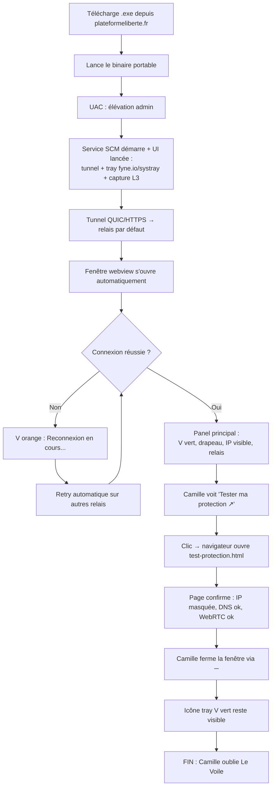

**Points UX clés :**
- Pas d'installation — un binaire portable lancé directement
- La fenêtre s'ouvre *automatiquement* — Camille n'a rien à chercher
- Le lien "Tester ma protection" est le call-to-action du premier lancement
- Le ─ est le geste naturel de sortie (pas le ✕)

### J2 — Changement de pays

**Contexte PRD :** Camille veut apparaître depuis l'Allemagne.

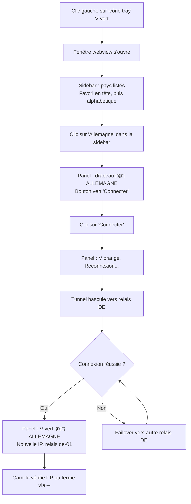

**Points UX clés :**
- Clic sur un pays différent = affiche le panel avec bouton "Connecter" vert (pas d'auto-connexion)
- L'utilisateur confirme explicitement le changement → évite toute déconnexion non désirée
- Transition visuelle V vert → V orange → V vert (< 5s) après clic "Connecter"

### J3 — Coupure réseau et failover

**Contexte PRD :** Le Wi-Fi du café tombe. Camille ne doit rien remarquer.

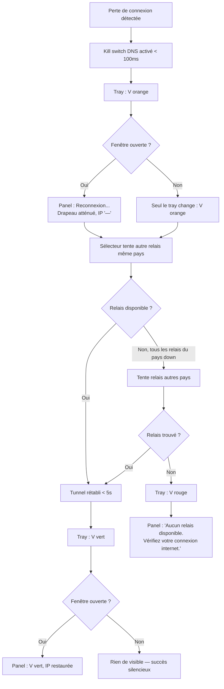

**Points UX clés :**
- Camille ne fait RIEN — tout est automatique
- Si la fenêtre est fermée, seul le tray change de couleur
- Le kill switch DNS empêche toute fuite pendant la bascule

### J4 — Quitter vs Minimiser

**Contexte :** Camille clique ✕ pour la première fois.

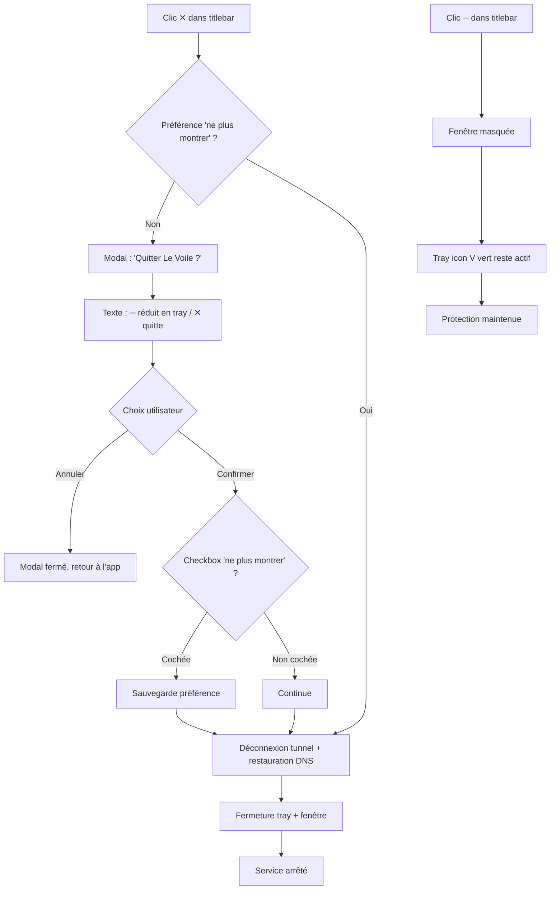

**Points UX clés :**
- Le ─ est le geste "normal" — réduire dans le tray, protection maintenue
- Le ✕ est destructif — il coupe la protection. D'où le modal pédagogique
- "Ne plus montrer" respecte les utilisateurs expérimentés

### J5 — Toggle WebRTC

**Contexte :** Camille a des problèmes avec Discord dans le navigateur.

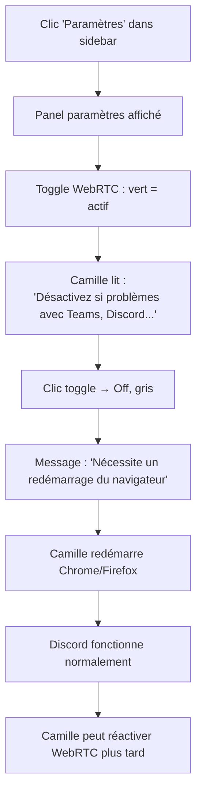

**Points UX clés :**
- Seul paramètre exposé — pas de surcharge cognitive
- Explication contextuelle claire (Teams, Discord = cas concrets)
- Avertissement redémarrage navigateur en orange
- Pas de badge texte — le toggle vert/gris suffit

### J9 — Théo active IPv6 hors tunnel (PRD parcours #7, FR8d)

**Contexte PRD :** Théo, développeur réseau dual-stack IPv4/IPv6, a installé Le Voile et constate que `test-ipv6.com` est bloqué (IPv6 droppé par défaut). Il préfère IPv6 en clair plutôt que bloqué.

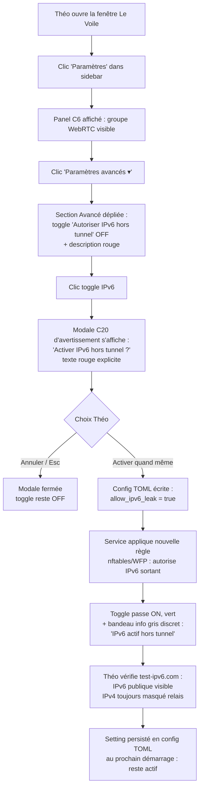

**Points UX clés :**
- **3 niveaux de friction** avant activation : section repliée par défaut → toggle dans Avancé → modale d'avertissement bloquante. L'utilisateur occasionnel ne tombe pas dessus par hasard
- La case « Ne plus me demander » dans la modale C20 est **par toggle** (pas globale) — désactiver IPv6 puis le réactiver représente un risque sécurité, donc l'utilisateur doit re-consentir explicitement la première fois
- L'état activé est visible discrètement (bandeau gris info, pas alerte rouge) — c'est un choix conscient de l'utilisateur, pas un mode dégradé temporaire
- **Pas de modale au désactivation** — repasser le toggle OFF restaure la sécurité, action positive non bloquante

### J10 — Camille active mode dégradé en gare (PRD parcours #8, FR16b)

**Contexte PRD :** Camille en mobilité, Wi-Fi public peu stable, Le Voile n'arrive pas à joindre un relais pendant 2 minutes. Kill switch actif → pas d'internet. Elle doit envoyer un email urgent.

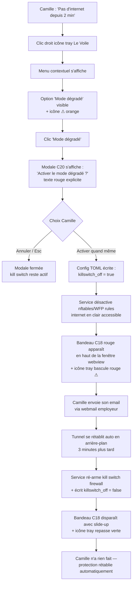

**Points UX clés :**
- **Indicateur visuel impossible à manquer** : le bandeau C18 rouge full-width + icône tray rouge ⚠ garantissent que Camille ne peut pas oublier qu'elle est exposée (rappel feedback memory `feedback_no_reset_endpoints` : sécurité primordiale)
- **Réactivation automatique** : dès qu'un tunnel passe, le service ré-arme le kill switch — Camille n'a pas à se rappeler de remettre la protection. Pattern « fail-safe by default »
- **Trigger possible aussi via CLI** `levoile-ctl killswitch off` — pour utilisateurs avancés ou scripts (mais soumis à modale C20 si lancé depuis UI ; CLI court-circuite la modale par convention CLI = utilisateur sait ce qu'il fait, mais journalise systématiquement)
- **Pas d'auto-désactivation par timer** — uniquement par succès tunnel. Si Camille ferme l'app pendant le mode dégradé, l'état persiste au redémarrage du service jusqu'à connexion réussie

### J11 — Service Le Voile non démarré (FR13c)

**Contexte :** Camille relance son PC après une mise à jour Windows. L'UI Le Voile démarre via autostart, mais le service `levoile-service` est arrêté (admin a stoppé le service, ou crash post-update).

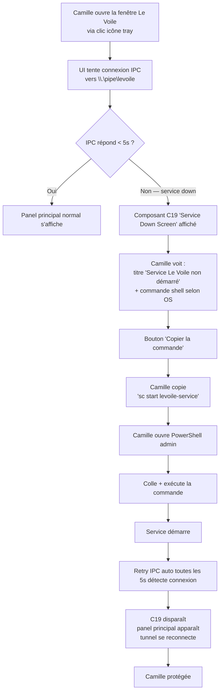

**Points UX clés :**
- **Aucun reset / restart endpoint dans l'UI** — l'UI ne propose PAS de bouton « Démarrer le service » (cohérent feedback memory `feedback_no_reset_endpoints` : recovery hors-bande uniquement, pas de path UI/IPC qui élève les privilèges du service)
- **Commande shell prête à copier** — réduit la friction pour utilisateur novice qui ne sait pas écrire la commande, sans pour autant donner à l'UI le pouvoir de démarrer le service (séparation privileges)
- **OS-aware** : le composant C19 détecte Windows/Linux et affiche la commande appropriée — pas de "Service is down, contact admin" générique inutilisable
- **Retry IPC silencieux toutes les 5s** : dès que le service redémarre (manuellement ou via systemd `Restart=on-failure` / SCM auto-restart), l'UI bascule automatiquement vers le panel normal — pas besoin de fermer/rouvrir la fenêtre
- **Lien dépannage** vers documentation externe pour les cas non-triviaux (service refuse de démarrer, capabilities cassées, etc.)

### J6 — Premier lancement Android avec onboarding « VPN permanent » (Phase 2)

**Contexte PRD (parcours Léa #9) :** Léa installe Le Voile via F-Droid sur son Pixel 7. C'est son premier lancement.

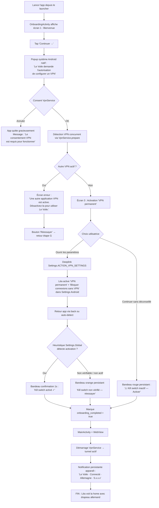

**Points UX clés :**
- L'écran 3 est le moment le plus sensible de tout l'onboarding Android — un seul CTA primaire « Ouvrir les paramètres », deeplink direct
- Le « Continuer sans » est intentionnellement discret (lien gris, pas un bouton) — l'utilisatrice doit faire un choix conscient
- La détection au retour de Settings utilise `MainActivity.onResume()` + heuristique `Settings.Global` (fragile, fallback documenté)
- Le bandeau persistant utilise 3 niveaux : vert disparaissant (1s, succès), orange persistant (non vérifiable, réessayer), rouge persistant (refus explicite, plus tard)
- L'onboarding ne se rejoue pas — `onboarding_completed=true` est persisté dans SharedPreferences. Pour re-déclencher : Réglages → Apps → Le Voile → Effacer données

### J7 — Swipe-close de l'app Android (Phase 2)

**Contexte :** Léa a fini de vérifier son IP. Réflexe Android quotidien : balayer pour fermer l'app.

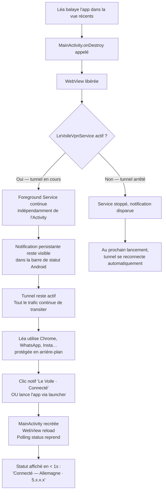

**Points UX clés :**
- **Le swipe-close n'arrête JAMAIS le tunnel.** C'est la règle fondamentale Android : seules les actions explicites (« Déconnecter » dans la notif, ou Forcer l'arrêt système) coupent la protection
- La notification persistante est le **contrat de confiance** : tant qu'elle est visible, le tunnel est actif. Si elle disparaît sans action explicite → bug à investiguer (battery save OEM agressif, OOM kill rare)
- La WebView est libérée — au retour, l'état est re-récupéré via `window.LeVoile.getStatus()` au premier polling. Pas de cache d'état JS persisté

### J8 — Mise à jour Android (F-Droid vs APK direct, Phase 2)

**Contexte :** Une nouvelle version de Le Voile est publiée (v0.2.0).

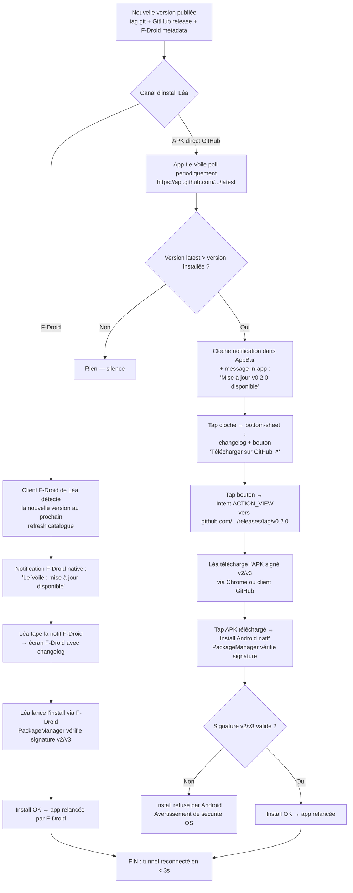

**Points UX clés :**
- **Pas d'auto-update embarqué côté APK direct** (limitation Android non-rooté + posture sécurité — pas d'élévation runtime). L'utilisatrice est toujours dans la boucle
- **F-Droid gère ses utilisateurs** — silence total côté Le Voile, c'est le client F-Droid qui notifie
- **Vérification signature systématique** par PackageManager — la promesse zero-tampering est tenue par l'OS, pas par notre code
- **Pas d'urgence** — pas de notification anxiogène ni de timer. L'utilisatrice met à jour quand elle veut. Si une CVE critique nécessite urgence : message in-app explicite avec contexte (« Sécurité : version recommandée v0.2.1, voir SECURITY.md »)

### Journey Patterns

| Pattern | Utilisé dans | Description |
|---|---|---|
| Transition V vert → orange → vert | J1, J2, J3 | Feedback visuel uniforme pour toute transition de connexion (desktop) |
| Action automatique silencieuse | J1, J3, J7 | Le système agit sans demander. L'utilisateur observe, pas décide |
| Clic = action immédiate | J2, J5 | Un clic sur un pays ou un toggle produit un effet instantané. Pas de confirmation |
| Fenêtre optionnelle | J3 | Le comportement est identique que la fenêtre soit ouverte ou non (desktop) |
| Modal pédagogique unique | J4 | Avertissement une fois, option "ne plus montrer" (desktop uniquement) |
| Onboarding obligatoire au premier lancement | J6 | 3 écrans séquentiels Android, dernière étape non-skippable (kill switch). Ne se rejoue jamais |
| Notification persistante = source de vérité | J7 | Tant qu'elle est visible, le tunnel est actif. Aucun moyen UI de la masquer |
| Mise à jour utilisateur-pull (Android) | J8 | Pas d'auto-update — l'utilisatrice valide explicitement chaque install |
| Bandeau d'alerte persistant (kill switch) | J6 | Rouge non-dismissable si « VPN permanent » non activé sur Android |

### Flow Optimization Principles

1. **Zéro confirmation sauf destruction** — Changer de pays = un clic. Toggle WebRTC = un clic. Seule action avec confirmation : quitter (✕), car elle détruit la protection
2. **Feedback visuel uniforme** — Toute transition de connexion suit le même pattern V vert → orange → vert. L'utilisateur apprend le code couleur une fois
3. **Fenêtre optionnelle** — Tous les flows fonctionnent identiquement que la fenêtre soit ouverte ou fermée. Le tray est suffisant
4. **Recovery automatique** — Aucun bouton "Réessayer". Le système résout les problèmes seul. L'utilisateur n'intervient que si internet est physiquement coupé

## Component Strategy

### Design System Components

Pas de design system externe. Tous les composants sont custom, construits en HTML/CSS/JS vanilla avec les design tokens de plateformeliberte.fr. La bibliothèque de composants est le fichier CSS unique de l'application.

### Custom Components

#### C1 — Titlebar Custom

**Purpose :** Barre de titre frameless avec identité Le Voile et contrôles fenêtre
**Anatomy :** V identitaire (couleur = statut) | "Le Voile" (texte) | zone drag | cloche notifications (C11) | ─ (minimiser) | ✕ (quitter)
**States :**
- Connecté : V vert (#4ade80)
- Reconnexion : V orange (#fb923c) pulsant
- Déconnecté : V rouge (#ff3c3c)

**Interaction :** Zone titre = drag fenêtre. ─ = masquer en tray. ✕ = modal quitter.
**Accessibilité :** Boutons ─ et ✕ focusables au clavier (Tab), aria-label "Réduire" et "Quitter"

#### C2 — Sidebar Navigation

**Purpose :** Navigation latérale avec onglet paramètres + liste de pays
**Anatomy :** Tab paramètres (⚙) | séparateur | pays favori (si défini) | pays alphabétiques
**States :**
- Tab/pays inactif : fond transparent
- Tab/pays hover : fond tertiary (#162a4a)
- Tab/pays actif : fond tertiary + bord gauche bleu accent (#2a8dff)

**Dimensions :** 150px largeur fixe, hauteur = fenêtre
**Accessibilité :** Navigation au clavier (flèches haut/bas), aria-current sur le pays actif

#### C3 — Country Item (sidebar)

**Purpose :** Élément pays dans la sidebar avec drapeau, nom et étoile favori
**Anatomy :** Drapeau emoji (16px) | nom pays | étoile favori
**States :**
- Défaut : texte primaire, étoile contour jaune
- Hover : fond tertiary, étoile jaune plein
- Actif : fond tertiary + bord gauche bleu
- Favori : étoile jaune plein, pays en tête de liste

**Interaction :** Clic nom = sélectionner pays. Clic étoile = toggle favori.
**Accessibilité :** aria-label "Sélectionner [pays]", aria-label "Marquer [pays] comme favori"

#### C4 — Star Favorite

**Purpose :** Indicateur/toggle favori sur chaque pays
**Anatomy :** Étoile (★) 14px
**States :**
- Défaut : contour jaune (#facc15), transparent intérieur
- Hover : jaune plein
- Favori actif : jaune plein permanent

**Interaction :** Clic = toggle. Un seul favori à la fois (le précédent est retiré).
**Accessibilité :** role="switch", aria-checked, aria-label

#### C5 — Status Panel (main)

**Purpose :** Panel principal affichant l'état de connexion
**Anatomy :** Status group (dot + texte) | grand drapeau (56px) | nom pays (Bebas Neue 28px) | IP visible | relais + latence | bouton déconnecter | lien tester
**States :**
- Connecté : dot vert, texte "Connecté", drapeau plein, IP affichée, bouton "Déconnecter"
- Reconnexion : dot orange pulsant, texte "Reconnexion...", drapeau opacity 0.6, IP "—", sous-texte "Basculement vers un autre relais..."
- Déconnecté : dot rouge, texte "Déconnecté", bouton "Connecter" (vert)
- Pays sélectionné (différent du connecté) : drapeau du nouveau pays, nom pays, bouton "Connecter" (vert), pas d'IP
- Erreur : dot rouge, texte "Aucun relais disponible", pas de bouton

**Accessibilité :** aria-live="polite" sur le statut pour annoncer les changements aux lecteurs d'écran

#### C6 — Settings Panel

**Purpose :** Panel paramètres avec toggle WebRTC + section "Avancé" repliable hébergeant les toggles à risque (IPv6 hors tunnel FR8d, Mode dégradé kill switch FR16b)
**Anatomy :**
- Titre « PARAMÈTRES » (Bebas Neue 24px)
- Section principale : groupe WebRTC (label + description + toggle C7) + lien tester (C10)
- Bouton-section repliable « Paramètres avancés ▾ » (Rajdhani 14px, opacity 0.7) — replié par défaut
- Section avancée dépliée :
  - Groupe IPv6 (FR8d) : label « Autoriser IPv6 hors tunnel » + description « L'IPv6 sortira en clair, votre IP réelle sera exposée sur les services IPv6 » + toggle C7 (off par défaut). Tap toggle → modale C20 avant activation
  - Groupe Mode dégradé (FR16b) : label « Mode dégradé (kill switch désactivé) » + description « Pour usage temporaire en captive portal ou réseau bloquant. Réactivation auto à la prochaine connexion tunnel réussie » + toggle C7 (off par défaut). Tap toggle → modale C20 avant activation
**States :** Affiché quand onglet paramètres sélectionné dans la sidebar. Section avancée dépliable/repliable (état persisté en mémoire UI uniquement, pas en config)
**Visibilité conditionnelle des toggles avancés :** toujours visibles (pas cachés derrière flag dev) — l'utilisateur doit pouvoir les trouver, mais le coût psychologique du « Paramètres avancés ▾ » filtre l'usage occasionnel
**Accessibilité :** Toggles avec `role="switch"`, `aria-checked`, `aria-label` explicite (« Autoriser IPv6 hors tunnel : désactivé »). Section repliable annoncée TalkBack/NVDA via `aria-expanded`. Modale C20 = `aria-modal="true"` avec focus trap

#### C7 — Toggle Switch

**Purpose :** Interrupteur on/off pour les paramètres
**Anatomy :** Piste (40×22px, border-radius 11px) | bouton circulaire (16px)
**States :**
- On : piste verte (#4ade80 à 30%), bouton vert, position droite
- Off : piste grise (#162a4a), bouton gris, position gauche
- Hover : légère augmentation d'opacité

**Interaction :** Clic = toggle instantané. Pas de confirmation.
**Accessibilité :** role="switch", aria-checked, focusable Tab, toggle Espace/Entrée

#### C8 — Quit Modal

**Purpose :** Modal d'avertissement quand l'utilisateur clique ✕
**Anatomy :** Overlay sombre (85% opacité + blur 4px) | modal card (300px max) : titre + texte + checkbox "Ne plus montrer" + boutons Annuler/Confirmer
**States :**
- Affiché : overlay + modal centré, contenu derrière atténué (opacity 0.3)
- Masqué : invisible

**Interaction :** Annuler = ferme modal. Confirmer = déconnecte + quitte. Esc = annuler.
**Accessibilité :** Focus trap dans le modal, aria-modal="true", focus initial sur "Annuler"

#### C9 — Status Dot

**Purpose :** Indicateur circulaire de statut (réutilisé dans titlebar, panel, tray)
**Anatomy :** Cercle 12px avec glow
**States :**
- Connecté : vert (#4ade80), glow vert
- Reconnexion : orange (#fb923c), glow orange, animation pulse 1.5s
- Déconnecté : rouge (#ff3c3c), glow rouge
- **Mode dégradé actif (FR16b)** : rouge (#d42b2b) avec halo rouge atténué — distinct du « déconnecté » par le contexte (tunnel actif mais kill switch off). Couplé à C18 Bandeau permanent dans la fenêtre webview

**Variation icône tray Windows/Linux :** l'icône systray Le Voile reflète le state dot — vert (connecté), orange (reconnexion), rouge déconnecté, **rouge plein avec ⚠ overlay (mode dégradé)** pour distinguer visuellement de l'état déconnecté pur

**Accessibilité :** Toujours accompagné de texte — ne sert pas seul. État mode dégradé annoncé TalkBack/NVDA via `aria-label` explicite : « Mode dégradé actif — protection désactivée »

#### C10 — Action Link

**Purpose :** Lien d'action secondaire ("Tester ma protection ↗")
**Anatomy :** Texte Rajdhani 600 14px + flèche ↗
**States :**
- Défaut : couleur accent glow (#2a8dff)
- Hover : souligné
- Focus : outline glow bleu

**Interaction :** Ouvre l'URL dans le navigateur par défaut (pas dans la WebView)
**Accessibilité :** `<a>` standard avec target="_blank", rel="noopener"

#### C11 — Notification Bell

**Purpose :** Indicateur de notifications non lues dans la titlebar
**Anatomy :** Icône cloche (16px) | badge orange avec chiffre (si notifications non lues)
**Position :** Titlebar, à gauche des boutons ─ et ✕
**States :**
- Pas de notification : cloche grise (#8a9bb8), pas de badge
- Notification(s) non lue(s) : cloche blanche (#f0f4ff), badge orange (#fb923c) avec chiffre
- Hover : légère augmentation d'opacité

**Interaction :** Clic = affiche le panel notifications (remplace le panel principal). Clic à nouveau ou clic sur un pays = retour au panel statut.
**Notifications supportées :** Mise à jour disponible, alerte sécurité (futur)
**Accessibilité :** aria-label "Notifications", aria-live sur le badge

#### C12 — Connect Button

**Purpose :** Bouton d'action positive pour se connecter à un pays
**Anatomy :** Bouton vert, texte "Connecter", Rajdhani 600
**States :**
- Défaut : fond vert (#4ade80), texte navy (#0b1526)
- Hover : vert plus lumineux, glow vert subtil (box-shadow 0 0 16px rgba(74, 222, 128, 0.3))
- Disabled : opacity 0.5 (pendant la transition)

**Visible quand :**
- L'utilisateur est déconnecté (après clic "Déconnecter")
- L'utilisateur a sélectionné un pays différent du pays actuellement connecté

**Accessibilité :** aria-label "Se connecter à [pays]"

#### C18 — Bandeau Mode Dégradé Desktop (FR16b)

**Purpose :** Bandeau persistant rouge dans la fenêtre webview tant que le mode dégradé est actif (kill switch firewall désactivé) — équivalent fonctionnel desktop du composant C17 Android
**Position :** Haut du panel principal, sous la titlebar C1, full-width, hauteur 36px
**Anatomy :** Icône ⚠️ (16px) + texte « Mode dégradé actif — protection désactivée » (Rajdhani 13px 600, blanc) + lien « Réactiver › » (Rajdhani 13px 700, souligné)
**States :**
- Affiché : fond rouge atténué (#d42b2b à 90% opacité), animation slide-down 200ms à l'apparition
- Non-dismissable par geste ou bouton de fermeture — seule action : tap « Réactiver › » → tente immédiatement une nouvelle connexion tunnel ; si succès, kill switch réactivé + bandeau disparaît avec slide-up 200ms
- Persiste tant que `[tunnel] killswitch_off = true` dans la config TOML

**Couplage runtime :**
- Activation : par menu tray « Mode dégradé » ou commande CLI `levoile-ctl killswitch off` (FR16b) → modale C20 d'avertissement → confirmation → bandeau apparaît + icône tray bascule rouge ⚠
- Désactivation automatique : à la prochaine connexion tunnel réussie, le service ré-arme le kill switch firewall et le bandeau disparaît automatiquement (FR16b)
- Désactivation manuelle : via tap « Réactiver › » du bandeau, ou menu tray « Mode dégradé » re-coché, ou `levoile-ctl killswitch on`

**Accessibilité :** `role="alert"`, `aria-live="assertive"` (annoncé immédiatement à l'apparition par NVDA/Orca/TalkBack). Bouton « Réactiver » focusable au Tab, activable Espace/Entrée

#### C19 — Service Down Screen (FR13c)

**Purpose :** Écran fixe affiché en plein panel quand l'UI ne peut pas joindre l'IPC du service Le Voile (service stoppé, crash, container sans systemd)
**Position :** Remplace le panel principal entièrement (titlebar C1 conservée)
**Anatomy :**
- Icône statut « offline » centrée (32px, gris #8a9bb8)
- Titre « Service Le Voile non démarré » (Bebas Neue 24px, blanc)
- Bloc texte explicatif (Inter 14px, max-width 360px) selon OS détecté :
  - **Linux :** « Le service Le Voile n'est pas démarré. Ouvrez un terminal et lancez : » + bloc-code monospace `sudo systemctl start levoile.service`
  - **Windows :** « Le service Le Voile n'est pas démarré. Ouvrez Services.msc et démarrez "Le Voile Service", ou utilisez : » + bloc-code monospace `sc start levoile-service` + note « (en admin) »
- Bloc-code : fond ardoise (#162a4a), bordure (#1a6fc4 1px), padding 12px, font-family `'JetBrains Mono', Consolas, monospace`, taille 13px, sélectionnable (`user-select: text`) pour faciliter le copier-coller
- Bouton secondaire « Copier la commande » (Rajdhani 13px 600, fond transparent, bordure bleue) → copie dans le presse-papier via `navigator.clipboard.writeText`
- Indicateur de retry en bas : « Reconnexion à venir… ⟳ » (Inter 12px, opacity 0.5) avec animation rotation discrète. Mis à jour à chaque tentative IPC (toutes les 5s, conformément FR13c)
- Lien d'aide (C10 Action Link) « Documentation dépannage ↗ » → ouvre URL doc plateformeliberte.fr/docs/troubleshoot dans navigateur

**States :**
- Affiché : pendant que `ipcClient.Connect()` retourne erreur depuis `> 5s` au démarrage UI ou pendant la vie de la session
- Disparu : dès que la première réponse IPC valide arrive (event `ipc:connected`) → re-render du panel principal sans recharger la fenêtre

**Détection OS :** côté Go avant injection dans le HTML via template, ou côté JS via `window.LeVoile.platform()` (méthode IPC ou fallback `navigator.userAgent`)

**Accessibilité :** Titre `<h1>` annoncé en premier, bloc-code marqué `<pre><code>` avec `role="region"` et `aria-label="Commande de démarrage du service"`, bouton « Copier la commande » avec `aria-label` complet et confirmation via `aria-live="polite"` après copie

#### C20 — Modale Avertissement Paramètres Avancés (FR8d, FR16b)

**Purpose :** Modale d'avertissement bloquante affichée avant d'activer un toggle à risque dans C6 (IPv6 hors tunnel ou Mode dégradé)
**Anatomy :** Variante de C8 Quit Modal — overlay sombre 85% + blur 4px + modal card 380px max
- Icône warning ⚠️ centrée (32px, orange #fb923c)
- Titre dynamique selon toggle : « Activer IPv6 hors tunnel ? » ou « Activer le mode dégradé ? »
- Texte explicatif rouge clair (Inter 14px) :
  - **IPv6 hors tunnel :** « L'IPv6 ne sera PAS protégé par Le Voile et exposera votre IP réelle sur les services IPv6. Votre IPv4 reste masqué par le relais. Ce paramètre est destiné aux utilisateurs avancés ayant validé qu'aucune information sensible ne fuit via IPv6. »
  - **Mode dégradé :** « Le kill switch firewall sera désactivé. Votre trafic ne sera pas protégé. Un bandeau rouge restera affiché tant que le mode est actif. La protection sera réactivée automatiquement à la prochaine connexion tunnel réussie. »
- Checkbox « Ne plus me demander pour ce paramètre » (Inter 13px, persistée par toggle, pas globalement)
- Boutons en pied de modale (alignés à droite) :
  - « Annuler » (Rajdhani 14px 600, fond transparent, focus initial) — ferme la modale, toggle reste désactivé
  - « Activer quand même » (Rajdhani 14px 700, fond rouge atténué #d42b2b) — confirme, applique le toggle, persiste config

**States :**
- Affiché : à chaque tap sur un toggle avancé sauf si « Ne plus me demander » coché précédemment pour ce toggle
- Esc ou clic overlay : équivalent « Annuler »
- Animation : fade-in overlay 150ms + scale-in card 200ms

**Conséquence post-confirmation :**
- IPv6 toggle ON → écrit `[tunnel] allow_ipv6_leak = true` dans config TOML, applique nouvelle règle nftables/WFP, journalise (sans data utilisateur — NFR22a)
- Mode dégradé ON → écrit `[tunnel] killswitch_off = true`, désactive nftables ruleset `inet levoile` ou WFP filters, journalise, **affiche immédiatement le bandeau C18**, bascule icône tray rouge ⚠

**Accessibilité :** `role="dialog"`, `aria-modal="true"`, focus trap dans la modale, focus initial sur « Annuler » (action sûre par défaut, conforme bonnes pratiques modales destructrices). Esc = annuler. Texte explicatif en `<p role="alert">` annoncé immédiatement par lecteurs d'écran

### Composants Android (Phase 2)

Composants spécifiques Android, en plus des composants C1-C12 desktop. Pas de mutualisation des classes CSS desktop ↔ Android : les composants desktop sont désactivés sur mobile via `body.platform-android` et le markup Android utilise des classes dédiées (`.android-appbar`, `.android-bottomsheet`, etc.).

#### C13 — AppBar Android

**Purpose :** Barre supérieure Material remplaçant la titlebar desktop
**Anatomy :** Burger menu (☰, 24dp) | titre « LE VOILE » (Bebas Neue 20sp) | espace flexible | cloche notifications (ⓘ) | menu overflow (⋮)
**Hauteur :** 56dp (standard Material)
**States :**
- Connecté : fond navy (#0b1526), titre blanc, statut implicite (pas de coloration AppBar)
- Pas de coloration sur transitions — l'état est porté par le Status Group du panel principal

**Interaction :** Burger ouvre un drawer latéral (paramètres, à propos, info légale, paramètres système Android). Cloche affiche les notifications in-app (mises à jour, alertes). Menu overflow : actions secondaires (jamais « Quitter » — pattern Android natif)
**Accessibilité :** `role="banner"`, focusable au TalkBack séquentiel, taille minimum 48dp pour les zones tappables

#### C14 — Country Selector Bottom-Sheet

**Purpose :** Sélection de pays en bottom-sheet Material (slide depuis le bas)
**Trigger :** Pill « CHANGER DE PAYS ▼ » dans le panel principal
**Anatomy :** Bottom-sheet 60% hauteur écran, drag handle au top, titre « PAYS » | liste verticale 4 pays : drapeau (40dp) + nom + indicateur favori + check si actif
**States :**
- Pays actif : check vert à droite, fond légèrement teinté
- Pays inactif : tappable, fond transparent
- Pays favori : étoile jaune avant le nom
- Animation : slide-up 250ms ease-out, slide-down au dismiss

**Interaction :** Tap sur un pays inactif → bottom-sheet se ferme + panel principal affiche le drapeau du nouveau pays + bouton « CONNECTER ». Tap pays actif = ferme sans action. Tap fond ou drag-down = annule
**Accessibilité :** `role="dialog"`, focus trap pendant ouverture, retour Android = dismiss, annonce TalkBack « Sélection de pays, [n] pays disponibles »

#### C15 — Onboarding Kill Switch Screen

**Purpose :** Écran 3 de l'onboarding obligatoire — activation « VPN permanent »
**Anatomy :**
- Icône warning (⚠️ 64dp, orange)
- Titre « Une dernière étape » (Bebas Neue 28sp)
- Texte explicatif (3 lignes max, Inter 16sp, max-width 320dp pour lisibilité)
- Sous-texte conséquence (2 lignes, Inter 14sp, opacity 0.7)
- Bouton primaire pleine largeur (Rajdhani 600 16sp, hauteur 48dp) : « OUVRIR LES PARAMÈTRES »
- Lien discret (Inter 13sp, opacity 0.5, underline) : « Continuer sans (déconseillé) »

**States :**
- Affichage initial : pas de retour (back désactivé jusqu'à interaction)
- Retour de Settings (onResume) : détection automatique heuristique → écran transitoire « Vérification… » (1s) puis MainActivity
- Heuristique détecte « non vérifiable » : affiche option supplémentaire « Réessayer » + « J'ai vérifié manuellement »

**Interaction :** Bouton primaire → `Intent(Settings.ACTION_VPN_SETTINGS)`. Lien discret → bottom-sheet de confirmation (« Continuer sans le kill switch ? Vous pourrez l'activer plus tard. ») + bandeau rouge persistant. Back Android désactivé sur cet écran (sécurité UX)
**Accessibilité :** `aria-live="polite"` sur le statut, focus initial sur le bouton primaire, contraste warning ≥ 4.5:1

#### C16 — Foreground Service Notification

**Purpose :** Notification persistante représentant l'état du tunnel — équivalent fonctionnel du tray desktop
**Channel :** `levoile_vpn_status` (importance LOW, silencieux, pas de heads-up)
**Anatomy :**
- Icône système (mono-couleur blanc/transparent, vector drawable `ic_levoile_status`)
- Titre : « Le Voile · [État] » (ex. « Le Voile · Connecté »)
- Texte : « [Pays] · [IP] » (ex. « Allemagne · 5.x.x.x »)
- Action : « DÉCONNECTER » (bouton notification action, PendingIntent FLAG_IMMUTABLE)

**States :**
- Connecté : icône statique, texte « Connecté · [Pays] · [IP] »
- Reconnexion : icône légèrement animée (alternance opacity), texte « Reconnexion… »
- Déconnecté : icône grisée, texte « Déconnecté » — la notification reste si le service tourne mais le tunnel est tombé
- Kill switch inactif : texte « ⚠️ Kill switch inactif · Activer » (tap → MainActivity → onboarding kill switch)
- Erreur : « Aucun relais · Vérifiez votre connexion »

**Interaction :**
- Tap sur le corps de la notification → ouvre `MainActivity` (PendingIntent ouvre l'app)
- Tap action « DÉCONNECTER » → `LeVoileVpnService.ACTION_DISCONNECT` → tunnel coupé, notification mise à jour (« Déconnecté »), service stoppé après 5s d'inactivité

**Contraintes :** `setOngoing(true)` → non-dismissable par swipe. `setSmallIcon` mono-couleur (Android exige). Pas de son (`setSilent(true)`), pas de vibration. Mise à jour via `notify(NOTIF_ID, builder.build())` à chaque transition d'état
**Accessibilité :** `setContentDescription` complet pour TalkBack, action accessible au focus séquentiel

#### C17 — Bandeau d'alerte kill switch (Android)

**Purpose :** Bandeau persistant rouge si « VPN permanent » non activé sur Android
**Position :** Haut du panel principal, sous AppBar, full-width, hauteur 40dp
**Anatomy :** Icône ⚠️ + texte « Kill switch inactif — Activer » + chevron ›
**States :**
- Affiché : fond rouge atténué (#d42b2b à 90%), texte blanc Rajdhani 14sp 600
- Non-dismissable par geste — seule action : tap → relance le flow C15

**Interaction :** Tap → ouvre directement l'écran C15 d'onboarding kill switch (sans rejouer écrans 1-2)
**Visible quand :** heuristique `Settings.Global.always_on_vpn_app` ne correspond pas au package Le Voile, OU détection « non vérifiable »
**Accessibilité :** `aria-live="assertive"`, annoncé immédiatement par TalkBack à l'apparition

### Component Implementation Strategy

**Desktop (Windows + Linux) :**
- Fichier unique : tous les composants C1-C12 + C18-C20 (extensions FR8d/FR16b/FR13c) dans un seul CSS (~360 lignes) + un seul JS (~240 lignes)
- Pas de bundler : HTML/CSS/JS servis directement par le serveur HTTP local du binaire UI (`internal/ui/embed.go` via `//go:embed`)
- Tokens CSS : variables `:root` partagées entre tous les composants (couleurs, spacing, typos)
- Communication Go ↔ JS : serveur HTTP local (`127.0.0.1:{port}`) avec API REST JSON, polling 2s
- C19 Service Down Screen : rendu quand `ipcClient.Connect()` échoue ; détection OS via template Go côté backend ou méthode UI bridge `window.LeVoile.platform()`

**Android (Phase 2) :**
- Mêmes assets HTML/CSS/JS que desktop, copiés via `android/scripts/sync-frontend.sh` au build
- Composants C13-C17 ajoutés via classes CSS dédiées `.android-*` activées par `body.platform-android` (set au boot par le frontend après détection JS bridge)
- Composants desktop (C1 Titlebar, C2 Sidebar, C3 Country Item, C4 Star Favorite, C8 Quit Modal) **désactivés** sur mobile via `body.platform-android .desktop-only { display: none }`
- Communication frontend ↔ natif : JS Bridge `@JavascriptInterface` (`window.LeVoile.connect()` etc.) — pas de serveur HTTP local
- Notification (C16) : composant natif Android (NotificationCompat.Builder), pas HTML

### Implementation Roadmap

**Phase 1 — MVP Core (bloquant) :**
- C1 Titlebar, C2 Sidebar, C3 Country Item, C5 Status Panel, C9 Status Dot, **C19 Service Down Screen**
- Raison : le flow J1 (premier lancement) et J2 (changement pays) en dépendent. C19 livré dès le MVP car le pire écran possible est une fenêtre vide quand le service crashe au boot — bloquant pour la confiance utilisateur (J11)

**Phase 2 — Interactions complètes :**
- C4 Star Favorite, C7 Toggle Switch, C8 Quit Modal, C10 Action Link, C12 Connect Button, **C18 Bandeau Mode Dégradé**, **C20 Modale Avertissement Avancé**
- Raison : J4 (quitter vs minimiser), flow de connexion explicite, confort d'usage. C18+C20 livrés ici car ils accompagnent FR16b (Story Epic 5.9) qui est dans la même vague d'interactions runtime

**Phase 3 — Paramètres & Notifications :**
- C6 Settings Panel (WebRTC + section avancée IPv6 FR8d + Mode dégradé FR16b), C11 Notification Bell
- Raison : J5 (toggle WebRTC), J9 (IPv6 hors tunnel), J10 (mode dégradé via menu tray), notifications mise à jour. Peut être livré après le MVP core mais avant le release Linux complet (Story Epic 2.9 FR8d et Story Epic 5.9 FR16b dépendent du panel C6 enrichi)

**Phase 2 Android — Composants mobiles :**
- C13 AppBar Android, C14 Country Selector Bottom-Sheet, C15 Onboarding Kill Switch Screen, C16 Foreground Service Notification, C17 Bandeau alerte kill switch
- Raison : J6 (premier lancement onboarding), J7 (swipe-close + notification), J8 (mise à jour). Tous bloquants pour le MVP Android — l'onboarding kill switch (C15) et la notification persistante (C16) sont les deux points UX critiques sans lesquels le produit Android n'a pas d'identité ni de promesse de protection vérifiable

## UX Consistency Patterns

### Button Hierarchy

**Action primaire positive :**
- Style : fond vert (#4ade80), texte navy (#0b1526), Rajdhani 600
- Hover : vert plus lumineux, glow vert subtil
- Usage : "Connecter" — visible uniquement quand déconnecté ou quand un pays différent est sélectionné
- Règle : un seul bouton vert par écran

**Actions destructives :**
- Style : transparent, texte rouge (#d42b2b), bordure rouge 30% opacité
- Hover : fond rouge 10% opacité, bordure rouge pleine
- Usage : "Déconnecter", "Confirmer" (quitter)
- Règle : une seule action destructive visible par écran

**Actions secondaires (annuler, retour) :**
- Style : transparent, texte secondaire (#8a9bb8), bordure bleu 20% opacité
- Hover : bordure bleu glow, texte primaire
- Usage : "Annuler" dans le modal

**Liens d'action :**
- Style : texte bleu glow (#2a8dff), Rajdhani 600, pas de soulignement
- Hover : soulignement
- Usage : "Tester ma protection ↗"
- Règle : toujours suffixé ↗ si ouvre un lien externe

### Feedback Patterns

**Transitions de connexion (pattern uniforme) :**

| Phase | Dot | V titlebar | Texte panel | IP | Action visible |
|---|---|---|---|---|---|
| Connecté | Vert glow | Vert | "Connecté" | IP visible | Bouton "Déconnecter" |
| Transition | Orange pulse | Orange | "Reconnexion..." | "—" | Aucun bouton |
| Déconnecté | Rouge glow | Rouge | "Déconnecté" | "—" | Bouton "Connecter" (vert) |
| Pays sélectionné (différent) | — | Couleur actuelle | Nom du pays | — | Bouton "Connecter" (vert) |
| Erreur | Rouge glow | Rouge | "Aucun relais disponible" | "—" | Aucun bouton |

**Règles de feedback :**
- Jamais de notification système (toast, popup Windows)
- Jamais de son
- Jamais de message technique (pas de codes d'erreur, pas de noms de protocoles)
- Le feedback est **visuel et passif** — l'utilisateur le voit s'il regarde, mais n'est jamais interrompu

**Notifications in-app (cloche) :**
- Icône cloche dans la titlebar (à gauche des boutons ─ et ✕)
- Badge orange avec chiffre si notifications non lues (ex: "1")
- Clic sur la cloche = panel notifications (remplace temporairement le panel principal)
- Types de notifications :
  - Mise à jour disponible : "Mise à jour prête — appliquée au prochain démarrage"
  - Alerte sécurité (futur) : "Fuite WebRTC détectée — protection renforcée"
- Les notifications sont marquées comme lues au clic
- Le badge disparaît quand toutes sont lues

### Navigation Patterns

**Sidebar comme navigation unique :**
- Pas de menu hamburger, pas de header nav, pas de tabs dans le panel
- La sidebar est le seul point de navigation
- Clic sur le pays actuellement connecté = affiche le panel statut (pas de changement)
- Clic sur un pays différent = affiche le panel statut de ce pays avec bouton "Connecter" vert (pas d'auto-connexion)
- Clic sur Paramètres = panel paramètres

**Logique de sélection pays :**
- Cliquer sur un pays ne connecte PAS automatiquement
- Si le pays cliqué est le pays actuellement connecté → panel statut normal ("Connecté", bouton "Déconnecter")
- Si le pays cliqué est différent → panel statut en attente : drapeau du nouveau pays, bouton "Connecter" vert, pas encore d'IP
- L'utilisateur confirme en cliquant "Connecter" → transition V orange → V vert
- Cela évite toute déconnexion non désirée

**Tray comme point d'entrée :**
- Clic gauche tray = toggle fenêtre (visible/masquée)
- Clic droit tray = menu contextuel minimal : Ouvrir la fenêtre | Quitter

### Modal Pattern

**Un seul modal dans toute l'app : le modal quitter.**

**Règles :**
- Overlay sombre 85% + blur 4px
- Contenu derrière atténué (opacity 0.3, pointer-events none)
- Focus trap (Tab reste dans le modal)
- Esc = Annuler
- Focus initial sur "Annuler" (action sûre)
- "Ne plus montrer" = préférence persistée

**Anti-pattern : pas de modal de confirmation pour changer de pays ou toggle WebRTC.** Ces actions sont immédiates et réversibles.

### Loading & Empty States

**Pas d'état "vide"** — Le Voile a toujours des relais dans le registre caché. Si le registre est corrompu, il est ignoré et re-téléchargé depuis un relais (cas exceptionnel géré côté Go).

**État de chargement initial :**
- Au lancement, avant la première connexion : V orange dans titlebar, panel affiche "Connexion en cours..." avec dot orange pulsant
- Pas de skeleton, pas de spinner — juste le pattern orange pulsant standard

**Pas de barre de progression** — Les transitions sont < 5s. Une animation pulse suffit.

### Text & Language Patterns

**Langue :** Français uniquement (public cible francophone). **Phase 2 Android :** strings.xml `values/` (en) + `values-fr/` (fr) — fr par défaut, en disponible si l'OS est en anglais
**Ton :** Informatif, calme, non-technique
**Règles :**
- Pas de points d'exclamation (sauf erreur critique)
- Pas de majuscules agressives (sauf titres Bebas Neue qui sont naturellement uppercase)
- Noms de pays en français ("Royaume-Uni" pas "UK", "États-Unis" pas "USA", "Allemagne" pas "Germany", "Espagne" pas "Spain")
- Messages d'erreur = description de la situation + suggestion, jamais un code technique

**Exemples :**
- "Connecté — Allemagne" (pas "Connected to de-01.levoile.dev:443")
- "Reconnexion en cours..." (pas "QUIC handshake failed, retrying...")
- "Aucun relais disponible. Vérifiez votre connexion internet." (pas "Error: all relays unreachable, timeout 3000ms")

### Android Specifics — Patterns dédiés (Phase 2)

Patterns propres à Android, qui n'existent pas (ou diffèrent) du desktop. Aucune mutualisation avec le desktop — ces patterns sont indépendants.

**Architecture UI :**
- Pas de fenêtre, pas de tray, pas de titlebar custom — l'écran entier est une WebView dans `MainActivity`. L'AppBar Material remplace la titlebar
- Pas de modal quitter (concept inadapté Android — l'utilisateur sort par back/home, le service continue)
- Pas de bouton « Quitter » UI — la déconnexion explicite passe uniquement par l'action de la notification persistante

**Cycle de vie & navigation :**
- **Back Android = mettre en background** sur l'écran principal (équivalent home). Sur les écrans secondaires (onboarding, paramètres in-app, bottom-sheet) = retour à l'écran précédent
- **Home Android = mettre en background** systématiquement
- **Swipe-close (vue récents) = détruire l'Activity** mais le Foreground Service continue. Notification persistante reste
- **Configuration changes (rotation, clavier)** : `MainActivity` déclare `android:configChanges="orientation|screenSize|smallestScreenSize|keyboardHidden|navigation"` — pas de recréation, l'état WebView est préservé

**Permissions runtime :**
- **`POST_NOTIFICATIONS`** (Android 13+) — demandée juste-à-temps au moment de démarrer le Foreground Service (pas au boot de l'app). Si refusée → service tourne mais notification masquée → bandeau orange in-app « Notification désactivée — réactivez-la pour voir l'état du tunnel »
- **Pas de permission Battery Optimization exemption** demandée par défaut (Android 12+ n'en a plus besoin pour les FGS VPN). Documentée comme conseil pour OEMs agressifs (Xiaomi, Huawei, Oppo) via le drawer paramètres

**Lifecycle Foreground Service :**
- **Notification ≤ 5s après `startForegroundService()`** (sinon ANR) — la notification est construite avant tout appel I/O
- **`START_REDELIVER_INTENT`** sur le service → si le système tue le process, redémarre avec le dernier intent. Au redémarrage, le service reconnecte automatiquement le tunnel (pays favori)
- **`onRevoke()`** appelé si l'utilisateur révoque le consent VpnService dans Settings → service stop propre, notification mise à jour « Le Voile · Consentement révoqué — réactivez le VPN »
- **`onDestroy()`** : nettoie threads pompe paquets, ferme fd VpnService, restore proxy système, cleanup coroutines scope

**Frontière JS Bridge :**
- Toutes les méthodes `@JavascriptInterface` retournent String (JSON) ou primitives — pas de types complexes (gomobile + JS Bridge gèrent mal)
- Sérialisation max 4 Ko par message (cohérent FR-AND-5)
- Méthodes exposées : `connect()`, `disconnect()`, `getStatus()`, `selectCountry(iso)`, `getRegistry()`, `checkLeak()`, `openVpnSettings()`, `openBatteryOptimizationSettings()`, `isAlwaysOnEnabled()`, `getPreferences()`, `setPreference(key, value)`, `quit()`
- Polling : `setInterval(window.LeVoile.getStatus, 2000)` côté JS — pause naturelle du WebView en background, pas d'optimisation manuelle nécessaire

**Distribution & mise à jour :**
- **F-Droid** : aucune notification in-app, le client F-Droid de l'utilisatrice gère tout
- **APK direct** : check periodique GitHub releases au boot + 1x/jour, cloche notification dans AppBar si nouvelle version, pas d'auto-install
- **Vérification signature** systématique par PackageManager — l'OS rejette toute install non signée v2/v3 par master key Ed25519

**Anti-patterns Android à éviter absolument :**
- Simuler un kill switch app-level (reconnect-loop, drop sockets) — refusé par ADR-10. Le seul kill switch valide est le réglage OS « VPN permanent »
- Forcer Battery Optimization exemption avant le premier Connect (UX agressive — laisser optionnel)
- Toaster ou snackbar à chaque transition d'état (silence par défaut — la notification dans la barre de statut suffit)
- Demander permissions sensibles non requises (`READ_EXTERNAL_STORAGE`, `ACCESS_FINE_LOCATION`, `READ_PHONE_STATE`)
- Crash reporters externes (Firebase Crashlytics, Sentry, Bugsnag) — refusé par ADR-15
- Hardcoder les textes utilisateur — toujours via `R.string.*` (strings.xml fr + en)
- Ouvrir une activité distincte pour chaque écran (over-engineering) — la WebView gère la navigation interne
- Recréer l'Activity sur rotation — déclarer `configChanges` pour préserver l'état

## Responsive Design & Accessibility

### Responsive Strategy

Le Voile a **deux stratégies responsives parallèles**, isolées par OS (cohérent ADR-08) :

**Desktop (Windows + Linux) — fenêtre fixe :**
- Fenêtre `webview/webview` 420×540px non redimensionnable, frameless
- Pas de breakpoints, un seul layout (Direction F — Split Sidebar)
- Adaptation DPI scaling uniquement (Windows 100%/125%/150%/200%)

**Android (Phase 2) — fully responsive vertical :**
- WebView plein écran, taille variable selon le device (typique 360×640dp à 420×900dp portrait)
- Layout vertical empilé (Direction Android — Mobile Vertical), media queries portrait/paysage
- Cibles tactiles ≥ 48dp (Material guidelines)
- Pas de version dédiée tablette (la WebView responsive couvre tablettes Android standard via fluid layout)
- Hors scope : iOS, Android TV, Wear OS, Android Auto

**Adaptation par moteur de rendu :**

| Plateforme | Moteur WebView | Particularités |
|---|---|---|
| Windows 10/11 | WebView2 (Chromium) | Référence de développement desktop. Rendu pixel-perfect. WebView2 Runtime requis (présent par défaut Windows 11) |
| Linux | WebKitGTK | Vérifier le rendu des fonts (Bebas Neue, Rajdhani, Inter). Fonts embarquées obligatoires. Dépendance déclarée dans paquets natifs |
| Android (Phase 2) | Android System WebView (Chromium) | Géré par `androidx.webkit`, `WebViewAssetLoader` sert les assets via `https://appassets.androidplatform.net/assets/...`. Mise à jour autonome par Play Services côté utilisateur |
| macOS (Phase 3) | WebKit (Safari) | Vérifier le rendu des animations CSS. Tester les coins arrondis frameless. Différé |

**Points d'attention cross-plateforme :**
- Fonts embarquées dans le binaire desktop / dans `android/app/src/main/assets/fonts/` côté Android (pas de CDN) → rendu identique partout
- Tester le DPI scaling Windows (125%, 150%, 200%) — les dimensions CSS doivent rester cohérentes
- Le system tray (desktop) se comporte différemment sur chaque OS : tester clic gauche/droit, tooltip, icônes .ico vs .png. Sur Android : la notification persistante est l'équivalent fonctionnel
- Tester le rendu Android sur émulateur API 29 + 33 + 34 (NFR-AND-10) ainsi que device physique Pixel 6+

### Breakpoint Strategy

**Desktop : pas de breakpoints.** Fenêtre fixe 420×540px. Un seul layout.

**Android : breakpoints CSS ciblés :**

```css
/* Détection plateforme — appliquée par le frontend au boot via JS bridge */
body.platform-android { ... }

/* Phone portrait (référence) — 320dp à 480dp largeur */
@media (max-width: 600px) and (orientation: portrait) {
  body.platform-android .desktop-only { display: none; }
  body.platform-android .android-only { display: block; }
  body.platform-android .country-selector-pill { display: block; }
  body.platform-android .country-sidebar { display: none; }
}

/* Phone paysage / tablette compacte — 600dp à 840dp */
@media (min-width: 601px) and (max-width: 840px) {
  body.platform-android { /* layout adapté plus large, panneau central centré max-width 480dp */ }
}

/* Tablette standard — 841dp+ */
@media (min-width: 841px) {
  body.platform-android { /* layout 2 colonnes optionnel, drapeau XL plus grand */ }
}
```

Pas de support spécifique tablette dédié — le layout s'adapte fluide. Pas de breakpoint > 1024dp (concept inutile sur Android grand écran qui est rare et déjà couvert).

### Accessibility Strategy

**Niveau cible : WCAG AA + RGAA niveau AA** (exigence légale produits français)

L'app est minimale, ce qui facilite l'accessibilité. Pas de formulaires complexes, pas de tableaux de données, pas de contenu dynamique lourd.

**Checklist accessibilité Le Voile — Desktop (Windows + Linux) :**

| Critère | Implémentation | Statut design |
|---|---|---|
| Contraste texte (4.5:1 min) | Tous les couples validés (section Visual Foundation) | Conçu |
| Contraste éléments UI (3:1 min) | Boutons, bordures, toggles vérifiés | Conçu |
| Couleur non-exclusive | Texte accompagne toujours la couleur de statut | Conçu |
| Taille cibles cliquables (44×44px) | Sidebar items, boutons, toggle, titlebar buttons | Conçu |
| Navigation clavier | Tab entre les éléments, Espace/Entrée pour activer | À implémenter |
| Focus visible | Outline bleu glow sur focus clavier | Conçu |
| Lecteur d'écran | aria-live sur statut, aria-labels sur tous les boutons (NVDA Windows / Orca Linux) | À implémenter |
| Focus trap modal | Tab reste dans le modal quitter quand ouvert | À implémenter |
| Skip content | Non nécessaire (pas de navigation longue) | N/A |

**Checklist accessibilité Le Voile — Android (Phase 2) :**

| Critère | Implémentation | Statut design |
|---|---|---|
| Contraste texte (4.5:1 min) | Mêmes tokens couleurs desktop, validés cross-OS | Conçu |
| **Cibles tactiles ≥ 48dp** (Material guidelines) | Boutons primaire/secondaire 48dp hauteur, AppBar items 48dp, country items bottom-sheet 56dp | Conçu |
| **TalkBack** (lecteur d'écran Android) | aria-labels FR + en sur tous les contrôles, `setContentDescription` sur les natifs (notification, AppBar) | À implémenter |
| **Focus order TalkBack séquentiel** sans piège | Top → bottom : AppBar burger → titre → cloche → menu overflow → status → drapeau → IP → relais → pill pays → bouton primaire → lien externe | Conçu |
| Couleur non-exclusive | Statut texte + dot + icône — jamais couleur seule | Conçu |
| Bottom-sheet accessible | `role="dialog"`, focus trap, retour Android = dismiss | Conçu |
| Notification accessible | `setContentDescription` complet, action lisible « Bouton, Déconnecter » | À implémenter |
| Onboarding accessible | Boutons primaires focus initial, lecteur d'écran annonce les écrans dans l'ordre | À implémenter |
| Bandeau alerte kill switch | `aria-live="assertive"` annoncé immédiatement par TalkBack | Conçu |
| Taille police réglable | Système Android (réglage utilisateur OS) — la WebView respecte automatiquement | À tester |
| Mode contraste élevé | Système Android — vérifier que les couleurs s'adaptent (ne pas hardcoder en `!important`) | À tester |

**Navigation clavier complète (desktop) :**
- Tab : parcourt titlebar buttons → sidebar items → panel actions
- Flèches haut/bas : navigue dans la sidebar
- Entrée/Espace : active l'élément focusé
- Esc : ferme le modal / retour

**Navigation TalkBack séquentielle (Android) :**
- Swipe droite/gauche : élément suivant/précédent dans l'ordre du DOM
- Double-tap : active l'élément focusé
- Geste personnalisé Android : retour, accueil, applications récentes
- Annonces vocales en français (langue OS) avec textes courts et précis

### Testing Strategy

**Tests visuels cross-plateforme :**
- Windows 10 + Windows 11 : WebView2, DPI 100%/125%/150%/200%
- Ubuntu (dernier LTS) : WebKitGTK
- Fedora : WebKitGTK
- Alpine : WebKitGTK
- macOS (Phase 3) : WebKit

**Tests visuels Android (Phase 2) :**
- Émulateur API 29 (Android 10), API 33 (Android 13), API 34 (Android 14) — couverture matrice NFR-AND-10
- Device physique Pixel 6+ (cible perf NFR-AND-2)
- Orientations : portrait (référence) + paysage
- Tailles : phone (360×640dp), phablet (412×892dp), tablette compacte (600×960dp)
- DPI : mdpi, hdpi, xhdpi, xxhdpi, xxxhdpi (assets icônes en multi-densité)
- Modes système : light/dark (Material You), contraste élevé, taille police agrandie

**Tests accessibilité :**
- Outil automatisé : axe-core intégré en dev (vérification WCAG AA) — desktop + WebView Android
- Navigation clavier manuelle (desktop) : vérifier que chaque action est atteignable sans souris
- Lecteur d'écran : NVDA (Windows), Orca (Linux), VoiceOver (macOS Phase 3), **TalkBack (Android Phase 2)**
- Simulation daltonisme : vérifier que vert/orange/rouge restent distinguables en protanopie et deutéranopie

**Tests Android complémentaires (Phase 2) :**
- Tests instrumentés Espresso + AndroidX Test sur la matrice émulateur — flow connect/disconnect, onboarding, bottom-sheet, notification action « Déconnecter »
- Tests intégration TalkBack : navigation séquentielle complète sans piège, focus order cohérent
- Tests performance : démarrage VpnService → tunnel actif < 3s sur Pixel 6+, RAM < 60 MB en fonctionnement normal
- Tests battery : Foreground Service survit en battery save (Android natif + simulation OEM agressif Xiaomi/Huawei via flags)
- Tests reproductibilité build F-Droid : 2 builds successifs depuis le même tag git → hash SHA256 identique
- Audit permissions APK : `apkanalyzer manifest permissions` ne révèle aucune permission dangereuse

**Tests terrain :**
- Tests avec les amis d'Akerimus (mentionnés dans le PRD) sur leurs machines réelles desktop + leurs téléphones Android personnels Phase 2

### Implementation Guidelines

**Desktop (HTML/CSS/JS desktop) :**
- HTML sémantique : `<nav>` pour la sidebar, `<main>` pour le panel, `<button>` pour les actions (pas de `<div onclick>`)
- ARIA : aria-current="page" sur le pays actif, aria-live="polite" sur le statut, aria-modal="true" sur le modal
- Focus : outline personnalisé (glow bleu #2a8dff), jamais `outline: none` sans alternative
- Fonts : toutes embarquées via @font-face, pas de dépendance réseau
- DPI : tester à chaque commit sur au moins 2 niveaux DPI (100% et 150%)

**Android (HTML/CSS/JS partagé desktop + composants natifs) :**
- HTML sémantique identique desktop, classes additionnelles `.android-*` pour les composants C13-C17
- ARIA cohérent desktop, mais tester systématiquement avec TalkBack (les `aria-live` peuvent être interprétés différemment)
- Focus : pas de focus clavier visible nécessaire (tactile par défaut), mais focus TalkBack géré via DOM order — éviter `tabindex` arbitraires
- Fonts : copiées via `sync-frontend.sh` dans `android/app/src/main/assets/fonts/` (Bebas Neue, Rajdhani, Inter en woff2)
- Strings utilisateurs : **jamais de hardcode** — passer par `R.string.*` côté Kotlin pour les composants natifs (notification, onboarding, AppBar). Côté HTML, utiliser un dictionnaire JS chargé selon `navigator.language`
- Permissions runtime : demandées juste-à-temps, jamais au boot
- Notifications : channel `levoile_vpn_status` créé dans `LeVoileApplication.onCreate()`, importance LOW
- Foreground Service : `startForeground()` appelé < 5s après `onStartCommand()` sans exception
- JS Bridge : toutes les méthodes `@JavascriptInterface` retournent String/Boolean/Int — pas de types complexes
